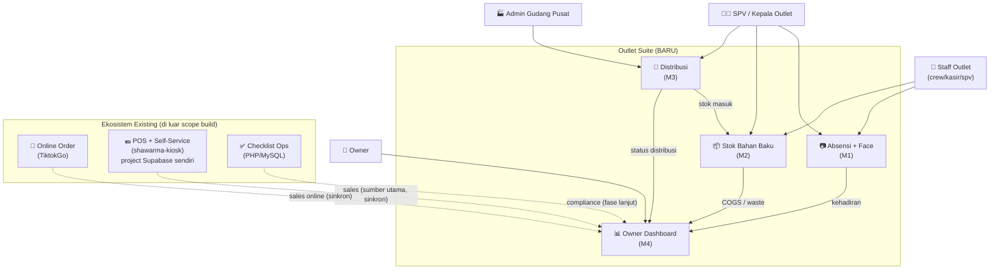
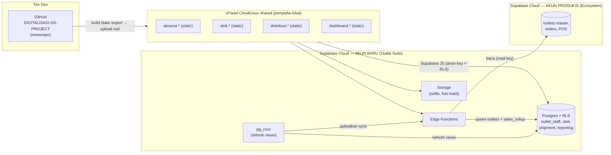
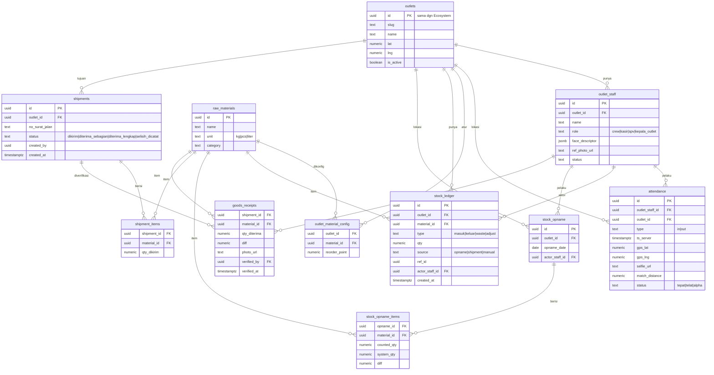
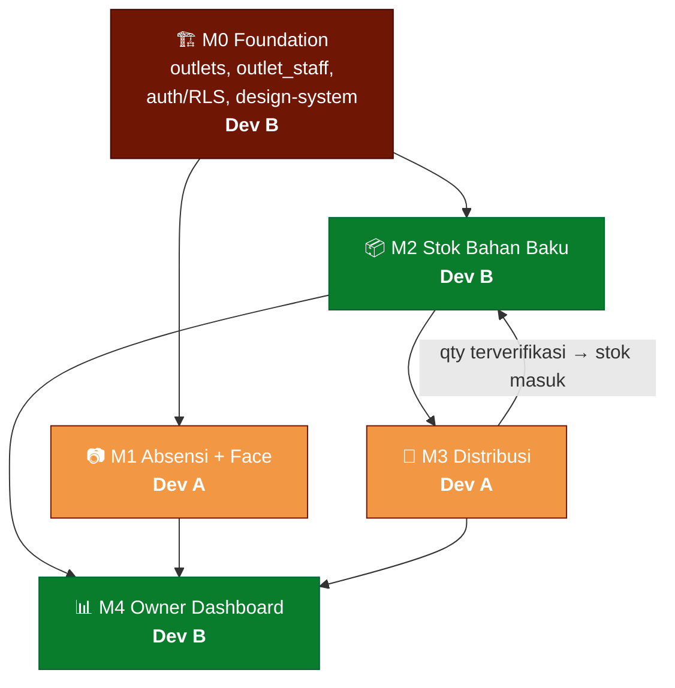
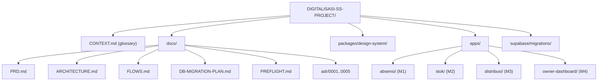
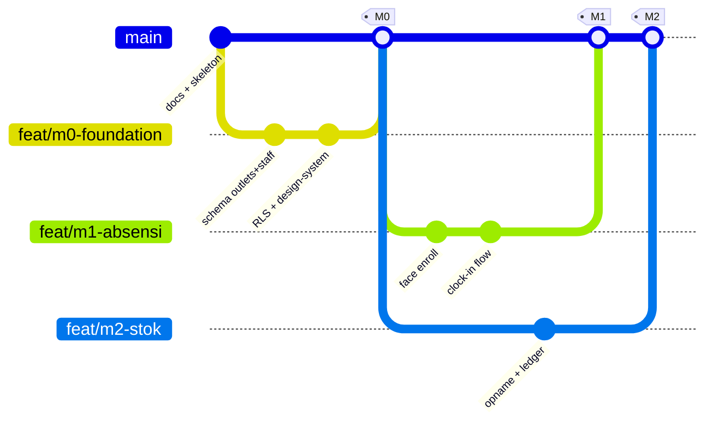

# Arsitektur — Sukashawarma Outlet Suite

Dokumen visual struktur sistem. Diagram pakai Mermaid (render otomatis di GitHub).
Lihat juga: [`PRD.md`](PRD.md) · [`FLOWS.md`](FLOWS.md) · [`DB-MIGRATION-PLAN.md`](DB-MIGRATION-PLAN.md) · [`adr/`](adr/)

---

## 1. Context Diagram — siapa pakai apa

---

## 2. Topologi Deployment — di mana semuanya tinggal

> Catatan: app = file **statis**; semua logika & data di Supabase. cPanel hanya menyajikan file. DB Outlet Suite di **akun Supabase berbeda** dari produksi (ADR-004). Static export (ADR-005). Sinkron antar-akun via Edge Function + pg_cron, bukan n8n (ADR-006).

---

## 3. ERD — model data Outlet Suite

---

## 4. Dependency Modul & Fase (2-track paralel)

| Fase | Dev A (Orange) | Dev B (Green) |
|------|----------------|----------------|
| 1 | M1 Absensi+Face | M0 Foundation |
| 2 | M3 Distribusi | M2 Stok |
| 3 | Integrasi M3→M2 | M4 Dashboard |

---

## 5. Struktur Repo (monorepo)

---

## 6. Alur Kerja Git (2 dev)

