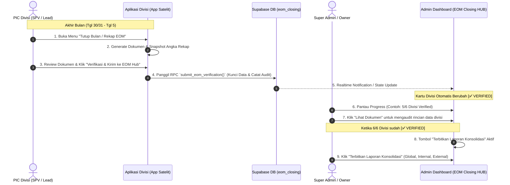

# Spesifikasi Teknis & Alur Operasional: EOM Closing Hub Terdistribusi Multi-App

Dokumen ini menjelaskan arsitektur dan alur kerja (**Workflow Hulu ke Hilir**) di mana setiap aplikasi divisi men-*generate* dokumen rekapitulasi akhir bulan, diverifikasi oleh PIC masing-masing aplikasi, lalu secara otomatis terkirim dan terdata di **Admin Dashboard (EOM Closing HUB)** secara *real-time*.

---

## 1. Diagram Alur Kerja Hulu ke Hilir



---

## 2. Pemetaan Aplikasi, Dokumen yang Di-generate, & PIC Verifikator

| # | Divisi | Aplikasi Sumber (`app`) | Dokumen Rekap yang Di-generate | Data Inti yang Di-snapshot | PIC Verifikator (Wewenang) |
|---|---|---|---|---|---|
| **1** | **Operasional Outlet & Kasir** | `apps/finance` (Modul Audit Kasir & Setoran) | **Berita Acara Rekapitulasi Kasir & Kas Toko** | • Omzet POS per outlet<br>• Rekap shift & selisih kas (*cash over/short*)<br>• Total setoran bank tervalidasi<br>• Total kas kecil (*petty cash*) terpakai<br>• Log void/refund transaksi | Finance Admin / SPV Kasir (`role: admin_finance` / `spv`) |
| **2** | **Kitchen & Gudang** | `apps/stok` atau `apps/distribusi` | **Berita Acara Stock Opname & Kerugian Stok** | • Nilai stok fisik akhir (19 outlet + Pusat)<br>• Nilai kerugian selisih stok (*shrinkage* Rp)<br>• Nilai kerugian bahan rusak/basi (*waste* Rp)<br>• Konfirmasi 100% surat jalan closed | SPV Kitchen / Gudang (`role: kitchen` / `spv`) |
| **3** | **Purchasing** | `apps/finance` (Tab Pengadaan) | **Berita Acara Rekap Pembelian & Hutang Dagang** | • Total PO masuk & barang diterima (GRN)<br>• Total tagihan/invoice supplier bulan berjalan<br>• Rekap hutang dagang jatuh tempo (*AP aging*)<br>• Catatan deviasi harga bahan pokok | Purchasing Lead (`role: admin_finance` / Purchasing) |
| **4** | **HR & Payroll** | `apps/HR` atau `apps/absensi` | **Berita Acara Absensi, Bonus & Register Gaji** | • Rekap absensi tuntas (sakit, izin, alpha)<br>• Total jam & nominal lembur tervalidasi<br>• Total bonus performa kru outlet<br>• Total potongan kasbon<br>• Total beban gaji bersih (*Payroll Slip Final*) | Admin HR / Head of HR (`role: admin_hr`) |
| **5** | **Marcom / Marketing** | `apps/marcom` | **Berita Acara Biaya Promosi & Kampanye** | • Total biaya *ad spend* (Meta, TikTok Ads)<br>• Total honorarium influencer / endorsement<br>• Total biaya POSM / cetak materi promosi<br>• Laporan ringkas ROAS per channel online | Marcom Lead (`role: admin` / Marketing) |
| **6** | **Finance & Accounting** | `apps/finance` (Tab Rekonsiliasi & Buku Kas) | **Berita Acara Rekonsiliasi Bank & Agregator** | • Status rekonsiliasi rekening koran (100% matched)<br>• Rekap selisih pencairan GoFood/Grab/Shopee/TikTok<br>• Rekap pengeluaran operasional kantor pusat (OPEX)<br>• Nilai persediaan akhir untuk neraca | Finance Lead / Controller (`role: admin_finance`) |

---

## 3. Desain Komponen UI di Aplikasi Satelit (Aplikasi Divisi)

Di setiap aplikasi yang bersangkutan, dibuatkan sub-menu atau modal penutupan bulan:

### Komponen: `<EomSubmissionCard />`
1. **Header:** Periode Bulan & Tahun (misal: *September 2026*).
2. **Ringkasan Indikator Kunci (Preview Angka):** Menampilkan metrik utama divisi yang telah ditarik dari database.
3. **Dokumen Preview:** Menampilkan pratinjau dokumen berita acara resmi (bisa diunduh format PDF atau dicetak).
4. **Catatan PIC:** Kolom teks opsional bagi PIC untuk mencatat temuan khusus (misal: *"Selisih kas Cabang Empang Rp 20.000 sudah diganti kasir"*).
5. **Tombol Aksi Utama:**
   - Tombol **`[ Verifikasi & Kirim ke EOM Closing Hub ]`** (Warna Hijau Suka Shawarma).
   - Terdapat dialog konfirmasi: *"Apakah Anda yakin data ini sudah final dan terverifikasi? Setelah verifikasi, data transaksi bulan ini akan dikunci."*
6. **State Pasca-Verifikasi:**
   - Tombol berubah menjadi badge: `[ ✅ SUDAH DIVERIFIKASI ]`
   - Keterangan: `Diverifikasi oleh Budi Santoso (SPV Kitchen) pada 02 Okt 2026, 11:20 WIB`.
   - Data otomatis terkunci (*read-only*).

---

## 4. Skema Database Supabase

Untuk mencatat aliran ini secara aman dan terintegrasi antar-aplikasi, dibuatkan tabel relasional dan RPC *SECURITY DEFINER*:

```sql
-- 1. Tabel Master Periode Tutup Buku
CREATE TABLE IF NOT EXISTS public.eom_closing_periods (
  id UUID PRIMARY KEY DEFAULT gen_random_uuid(),
  bulan INT NOT NULL CHECK (bulan BETWEEN 1 AND 12),
  tahun INT NOT NULL CHECK (tahun >= 2026),
  cut_off_at TIMESTAMPTZ NOT NULL,
  status TEXT NOT NULL DEFAULT 'open' CHECK (status IN ('open', 'all_verified', 'finalized')),
  finalized_at TIMESTAMPTZ,
  finalized_by UUID REFERENCES public.outlet_staff(id),
  created_at TIMESTAMPTZ NOT NULL DEFAULT NOW(),
  updated_at TIMESTAMPTZ NOT NULL DEFAULT NOW(),
  UNIQUE (bulan, tahun)
);

-- 2. Tabel Submisi Verifikasi per Divisi
CREATE TABLE IF NOT EXISTS public.eom_closing_submissions (
  id UUID PRIMARY KEY DEFAULT gen_random_uuid(),
  period_id UUID NOT NULL REFERENCES public.eom_closing_periods(id) ON DELETE CASCADE,
  divisi TEXT NOT NULL CHECK (divisi IN (
    'operasional_outlet',
    'kitchen_gudang',
    'purchasing',
    'hr_payroll',
    'marcom',
    'finance_akuntansi'
  )),
  app_source TEXT NOT NULL,
  status TEXT NOT NULL DEFAULT 'draft' CHECK (status IN ('draft', 'verified', 'rejected')),
  ringkasan_data JSONB NOT NULL DEFAULT '{}'::jsonb,
  dokumen_url TEXT,
  catatan TEXT,
  verified_by UUID NOT NULL REFERENCES public.outlet_staff(id),
  nama_pic TEXT NOT NULL DEFAULT '',
  role_pic TEXT NOT NULL DEFAULT '',
  verified_at TIMESTAMPTZ NOT NULL DEFAULT NOW(),
  created_at TIMESTAMPTZ NOT NULL DEFAULT NOW(),
  updated_at TIMESTAMPTZ NOT NULL DEFAULT NOW(),
  UNIQUE (period_id, divisi)
);

-- Index untuk performa querying EOM Hub
CREATE INDEX IF NOT EXISTS idx_eom_submissions_period_divisi 
ON public.eom_closing_submissions (period_id, divisi);
```

### RPC Pengiriman Verifikasi (`submit_eom_verification`):
```sql
CREATE OR REPLACE FUNCTION public.submit_eom_verification(
  p_bulan INT,
  p_tahun INT,
  p_divisi TEXT,
  p_app_source TEXT,
  p_ringkasan_data JSONB,
  p_catatan TEXT DEFAULT NULL,
  p_dokumen_url TEXT DEFAULT NULL
)
RETURNS JSONB
LANGUAGE plpgsql
SECURITY DEFINER
AS $$
DECLARE
  v_staff_id UUID;
  v_staff_name TEXT;
  v_staff_role TEXT;
  v_period_id UUID;
  v_submission_id UUID;
BEGIN
  -- 1. Validasi Autentikasi Pengguna
  v_staff_id := auth.uid();
  IF v_staff_id IS NULL THEN
    RAISE EXCEPTION 'Akses ditolak: User belum login.';
  END IF;

  SELECT name, role INTO v_staff_name, v_staff_role
  FROM public.outlet_staff
  WHERE id = v_staff_id;

  -- 2. Dapatkan atau Buat Otomatis Periode Bulan Ini
  INSERT INTO public.eom_closing_periods (bulan, tahun, cut_off_at)
  VALUES (p_bulan, p_tahun, (make_date(p_tahun, p_bulan, 1) + interval '1 month' - interval '1 second'))
  ON CONFLICT (bulan, tahun) DO UPDATE SET updated_at = NOW()
  RETURNING id INTO v_period_id;

  -- 3. Upsert Baris Submisi Verifikasi
  INSERT INTO public.eom_closing_submissions (
    period_id,
    divisi,
    app_source,
    status,
    ringkasan_data,
    dokumen_url,
    catatan,
    verified_by,
    nama_pic,
    role_pic,
    verified_at
  ) VALUES (
    v_period_id,
    p_divisi,
    p_app_source,
    'verified',
    p_ringkasan_data,
    p_dokumen_url,
    p_catatan,
    v_staff_id,
    COALESCE(v_staff_name, 'Staff'),
    COALESCE(v_staff_role, 'spv'),
    NOW()
  )
  ON CONFLICT (period_id, divisi) DO UPDATE SET
    status = 'verified',
    ringkasan_data = EXCLUDED.ringkasan_data,
    dokumen_url = COALESCE(EXCLUDED.dokumen_url, eom_closing_submissions.dokumen_url),
    catatan = EXCLUDED.catatan,
    verified_by = EXCLUDED.verified_by,
    nama_pic = EXCLUDED.nama_pic,
    role_pic = EXCLUDED.role_pic,
    verified_at = NOW(),
    updated_at = NOW()
  RETURNING id INTO v_submission_id;

  -- 4. Periksa apakah sudah 6/6 divisi terverifikasi
  IF (SELECT COUNT(*) FROM public.eom_closing_submissions WHERE period_id = v_period_id AND status = 'verified') >= 6 THEN
    UPDATE public.eom_closing_periods SET status = 'all_verified', updated_at = NOW() WHERE id = v_period_id;
  END IF;

  RETURN jsonb_build_object(
    'success', true,
    'submission_id', v_submission_id,
    'period_id', v_period_id,
    'status', 'verified',
    'verified_at', NOW()
  );
END;
$$;
```

---

## 5. Tampilan EOM Closing HUB di Admin Dashboard (`apps/admin-dashboard`)

Pada `apps/admin-dashboard`, halaman baru `/dashboard/owner/closing-hub` atau `/dashboard/admin/closing-hub` akan memiliki dua komponen utama:

### A. Matrix Status 6 Divisi (Live Grid)
Setiap kartu menampilkan status submisi real-time:

```
+---------------------------------------------------------------------------------------------------------+
|                                    STATUS VERIFIKASI 6 DIVISI                                           |
|                                        (5 dari 6 Terverifikasi)                                         |
+------------------------------------+------------------------------------+-------------------------------+
| 1. OPERASIONAL OUTLET              | 2. KITCHEN & GUDANG                | 3. PURCHASING                 |
| Status : [ ✅ VERIFIED ]           | Status : [ ✅ VERIFIED ]           | Status : [ ⏳ PENDING ]       |
| PIC    : Fajar (SPV Ops)           | PIC    : Budi (SPV Kitchen)        | PIC    : -                    |
| Waktu  : 01 Okt 2026, 14:15 WIB    | Waktu  : 02 Okt 2026, 10:30 WIB    | Waktu  : Menunggu Verifikasi  |
| Ringkasan: Omzet Rp 580.4jt        | Ringkasan: Waste Rp 4.2jt          | Ringkasan: Draft 18 PO        |
| [ 📄 Buka Dokumen BA Kasir ]       | [ 📄 Buka Dokumen BA Stok ]        | [ 🔔 Kirim Notifikasi PIC ]   |
+------------------------------------+------------------------------------+-------------------------------+
| 4. HR & PAYROLL                    | 5. MARCOM & PROMOSI                | 6. FINANCE & REKONSILIASI     |
| Status : [ ✅ VERIFIED ]           | Status : [ ✅ VERIFIED ]           | Status : [ ✅ VERIFIED ]      |
| PIC    : Sarah (Admin HR)          | PIC    : Dimas (Marcom Lead)       | PIC    : Rina (Finance Lead)  |
| Waktu  : 02 Okt 2026, 16:45 WIB    | Waktu  : 03 Okt 2026, 09:20 WIB    | Waktu  : 04 Okt 2026, 15:10 WIB|
| Ringkasan: Gaji Rp 82.5jt          | Ringkasan: Ads Rp 14.8jt           | Ringkasan: Bank Matched 100%  |
| [ 📄 Buka Dokumen BA Payroll ]     | [ 📄 Buka Dokumen BA Marcom ]      | [ 📄 Buka Dokumen BA Rekon ]  |
+------------------------------------+------------------------------------+-------------------------------+
```

### B. Master Action Bar & Tab Konsolidasi
* **Sebelum 6/6 Lengkap:** Tombol *"Terbitkan Master Report"* berwarna abu-abu (terkunci), dengan teks panduan: *"Menunggu 1 divisi lagi (Purchasing) sebelum laporan konsolidasi dapat diterbitkan."*
* **Setelah 6/6 Lengkap:** 
  - Tombol menyala hijau terang: **`[ 🚀 TERBITKAN LAPORAN KONSOLIDASI AKHIR BULAN ]`**.
  - Saat diklik oleh Super Admin / Owner, sistem melakukan pembekuan permanen (*freeze*) dan membuka **3 Tab Laporan**:
    - **Tab 1: Global (Total Konsolidasi)**
    - **Tab 2: Outlet Internal (Pusat)**
    - **Tab 3: Outlet External (Mitra / Investor)**
  - Dilengkapi fitur unduh **Bundle Dokumen Lengkap (1 Dokumen Master + 6 Lampiran Berita Acara Divisi)** dalam format PDF & Excel.

---

## 6. Keunggulan Sistem Ini bagi Suka Shawarma

1. **Akuntabilitas Jelas (Audit Trail Otomatis):** Setiap data memiliki nama PIC, tanggal, dan jam verifikasi yang tersimpan permanen di database. Tidak ada lagi aksi lempar tanggung jawab jika terjadi selisih angka.
2. **Zero Manual Copy-Paste:** Admin pusat tidak perlu lagi meminta file Excel via WhatsApp lalu menggabungkannya secara manual. Semua data mengalir otomatis melalui Supabase.
3. **Peringatan Dini Keterlambatan:** Jika hingga tanggal 4 ada divisi yang belum verifikasi, Admin Dashboard langsung memberi tanda kuning/merah agar SPV terkait dapat segera dihubungi sebelum batas waktu tanggal 5.
4. **Transparansi bagi Investor / Mitra:** Laporan outlet eksternal langsung mengacu pada dokumen stok dan operasional yang telah diverifikasi resmi oleh SPV lapangan.
