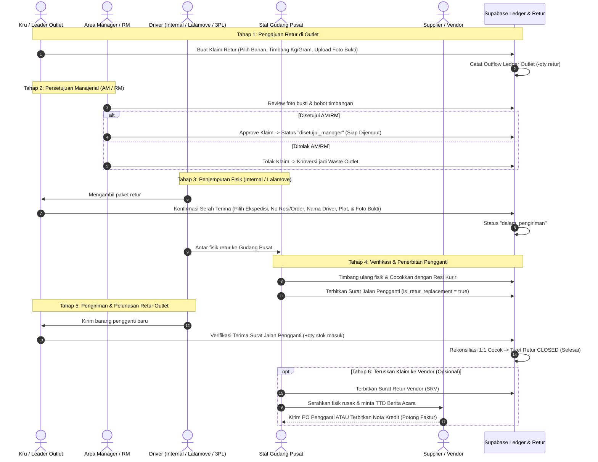

# Desain Alur Retur & Refund Bahan Baku (Item Core)

Dokumen ini mendokumentasikan spesifikasi desain dan alur operasional untuk penanganan bahan baku yang dapat di-retur / refund (*refundable items*), khususnya item core bernilai tinggi: **AYAM**, **SAPI**, dan **KULIT (25, 28, 32)**.

---

## 1. Latar Belakang & Tujuan
Bahan baku seperti ayam potong/fillet, daging sapi blok, dan kulit tortila merupakan komponen biaya terbesar (item core) di Suka Shawarma. Bahan-bahan ini sensitif terhadap suhu, pembusukan, atau kecacatan kemasan vacum dari pabrik/vendor.

Tujuan sistem ini:
1. Memberikan jalur resmi bagi **Outlet** untuk mengembalikan (*retur*) bahan rusak ke **Central Kitchen** tanpa menanggung kerugian stok fiktif.
2. Memastikan adanya **validasi manajerial (Approval AM/RM)** sebelum barang diizinkan ditarik oleh logistik.
3. Mendukung integrasi pencatatan **Kurir Internal maupun Ekspedisi Pihak Ketiga (3PL: Lalamove, GoSend, Deliveree)** lengkap dengan nomor resi/order ID dan foto serah terima untuk mencegah barang hilang di jalan.
4. Memastikan outlet mendapatkan **penggantian barang fisik 100% (*Replacement*)** via Surat Jalan Pengganti agar kontinuitas penjualan terjaga.
5. Memfasilitasi **Central Kitchen** untuk mengumpulkan bukti fisik dan mengajukan klaim **Retur ke Vendor/Supplier** (tukar barang atau potong tagihan invoice).
6. Menjaga integritas saldo kartu stok (`ledger_stok`) di setiap titik perpindahan fisik.

---

## 2. Decision Log
* **Arah Utama**: Outlet $\rightarrow$ Central Kitchen $\rightarrow$ Vendor/Supplier.
* **Momen Pengajuan**: Mendukung 2 skenario:
  1. *Inbound (Verifikasi SJ)*: Ditolak langsung di depan kurir saat kiriman baru datang.
  2. *Pasca-Terima (Chiller)*: Ditemukan rusak saat sudah berada di penyimpanan outlet.
* **Approval Wajib AM / RM**: Setiap pengajuan retur dari outlet **wajib disetujui terlebih dahulu oleh Area Manager (AM) atau Regional Manager (RM)** sebelum kurir diizinkan menjemput fisik barang.
* **Dukungan Logistik Fleksibel (Internal & 3PL Lalamove/GoSend)**: Form serah terima mencatat jenis ekspedisi, nama driver, no. plat kendaraan, nomor order/resi Lalamove, serta foto serah terima paket.
* **Bentuk Kompensasi Outlet**: Ganti Barang Fisik (*100% Replacement*) via Surat Jalan Pengganti.
* **Perlakuan Fisik Bahan**: Wajib diangkut kembali ke Central Kitchen (tidak dibuang di outlet) sebagai dasar klaim ke supplier pemotong.
* **Penempatan Antarmuka**: Halaman Mandiri `/stok/refund` (dengan tab status internal), terhubung di BottomNav menu "Lainnya" dan Quick Action Dashboard.
* **Rekonsiliasi**: Wajib 1:1 matching antara kuantitas retur dengan kuantitas Surat Jalan Pengganti sebelum tiket berstatus `selesai`.
* **Retur ke Vendor**: Central Kitchen dapat menerbitkan Surat Retur Vendor (SRV) dari akumulasi fisik retur outlet maupun dari pemeriksaan PO gudang pusat.

---

## 3. End-to-End Conceptual Flow

---

## 4. Model Data & Skema Database

### A. Tabel `bahan_baku`
* Tambahan kolom: `is_refundable BOOLEAN DEFAULT FALSE`.
* Diaktifkan hanya untuk `AYAM`, `SAPI`, `KULIT 25`, `KULIT 28`, `KULIT 32`.

### B. Tabel `retur_stok`
* `id UUID PRIMARY KEY DEFAULT gen_random_uuid()`
* `nomor_retur VARCHAR NOT NULL UNIQUE` (Format: `RET-YYYYMMDD-XXXX`)
* `outlet_id UUID NOT NULL REFERENCES outlets(id)`
* `tipe_retur VARCHAR NOT NULL` (`inbound_sj` | `chiller_outlet`)
* `status VARCHAR NOT NULL DEFAULT 'diajukan'`
  * `'diajukan'`: Klaim baru dibuat outlet, menunggu approval AM/RM.
  * `'disetujui_manager'`: Disetujui oleh AM/RM, siap dijemput logistik.
  * `'dalam_pengiriman'`: Fisik diserahkan ke driver (internal/Lalamove).
  * `'diterima_kitchen'`: Fisik tiba di Gudang Pusat & diverifikasi timbang ulang.
  * `'menunggu_stok'`: Menunggu persediaan kitchen sebelum kirim pengganti.
  * `'dikirim_pengganti'`: Surat jalan pengganti sedang menuju outlet.
  * `'selesai'`: Barang pengganti diterima lengkap di outlet.
  * `'ditolak'`: Klaim ditolak AM/RM atau Kitchen (stok dikonversi ke waste outlet).
* `approved_by_manager UUID NULL REFERENCES outlet_staff(id)` (AM / RM)
* `approved_manager_at TIMESTAMPTZ NULL`
* **Informasi Logistik & Pengiriman (Internal & 3PL)**:
  * `jenis_logistik VARCHAR NOT NULL DEFAULT 'internal'` (`internal`, `lalamove`, `gosend`, `grabexpress`, `deliveree`, `lainnya`)
  * `nomor_resi_order VARCHAR NULL` (Nomor Order / Resi Lalamove / Delivery)
  * `driver_nama VARCHAR NULL` (Nama supir)
  * `driver_kontak VARCHAR NULL` (No. HP / WA supir)
  * `driver_plat_kendaraan VARCHAR NULL` (Plat nomor motor / mobil)
  * `foto_serah_terima_url TEXT NULL` (Foto bukti paket saat diserahkan ke kurir)
  * `diserahkan_driver_at TIMESTAMPTZ NULL`
* `verified_by_kitchen UUID NULL REFERENCES outlet_staff(id)`
* `verified_kitchen_at TIMESTAMPTZ NULL`
* `catatan_kitchen TEXT NULL`
* `ref_surat_jalan_asal_id UUID NULL REFERENCES surat_jalan(id)`
* `ref_surat_jalan_pengganti_id UUID NULL REFERENCES surat_jalan(id)`
* `created_by UUID REFERENCES outlet_staff(id)`
* `created_at TIMESTAMPTZ DEFAULT NOW()`

### C. Tabel `retur_stok_item`
* `id UUID PRIMARY KEY DEFAULT gen_random_uuid()`
* `retur_stok_id UUID NOT NULL REFERENCES retur_stok(id) ON DELETE CASCADE`
* `bahan_baku_id UUID NOT NULL REFERENCES bahan_baku(id)`
* `qty_klaim NUMERIC(12, 4) NOT NULL` (Kuantitas satuan besar / kg)
* `qty_diterima_kitchen NUMERIC(12, 4) NULL`
* `foto_fisik_url TEXT NOT NULL`
* `foto_timbangan_url TEXT NOT NULL`
* `alasan VARCHAR NOT NULL` (`basi_bau`, `berubah_warna`, `vacum_bocor`, `rusak_pengiriman`, `lainnya`)
* `catatan TEXT NULL`

### D. Tabel `retur_vendor` & `retur_vendor_item`
* Mencatat Surat Retur Vendor (SRV) dari Gudang Pusat ke Supplier eksternal.
* `resolusi`: `tukar_barang` atau `potong_tagihan`.
* `ref_po_id`: Referensi PO asal/pengganti.
* `status`: `draft`, `diajukan`, `disetujui`, `selesai`.

---

## 5. Dampak Ledger Stok

| Aksi | Lokasi | Tipe Ledger | Arah Saldo | Keterangan |
|---|---|---|---|---|
| Outlet ajukan retur dari chiller | Outlet | `retur_ke_pusat` | `-` (Outflow) | Mengurangi stok siap jual agar kasir tidak menjual daging rusak |
| AM/RM tolak klaim | Outlet | `waste` | `0` (Koreksi) | Saldo tetap minus, tipe dialihkan resmi menjadi beban waste outlet |
| Outlet tolak saat terima SJ | Outlet | `terima_kiriman` | `+` (Inflow hanya yg bagus) | Qty rusak tidak pernah masuk stok outlet |
| Outlet terima SJ Pengganti | Outlet | `terima_kiriman` | `+` (Inflow) | Mengembalikan saldo outlet ke jumlah utuh |
| Gudang Pusat terima fisik retur | Gudang Pusat | `terima_retur_outlet` | `+` (Karantina) | Ditampung di stok retur/karantina |
| Gudang Pusat serahkan ke Vendor | Gudang Pusat | `retur_ke_vendor` | `-` (Outflow) | Mengeluarkan fisik rusak ke supplier |

---

## 6. Antarmuka Pengguna (UI Layout `/stok/refund`)

1. **Header & Tab Navigasi**:
   * Tab 1: **"Klaim Berjalan"** (Daftar tiket aktif + Stepper tracking: `Diajukan -> Disetujui AM/RM -> Dijemput Driver -> Kitchen -> SJ Pengganti -> Selesai`).
   * Tab 2: **"Riwayat Selesai"** (Arsip tiket yang sudah selesai / ditolak).
   * Tab 3 *(AM / RM)*: **"Persetujuan Manager"** (Tombol Setujui / Tolak Klaim Outlet dengan inspeksi foto bukti).
   * Tab 4 *(Khusus Kitchen)*: **"Antrean Kitchen"** (Verifikasi timbang fisik tiba, pencocokan nomor resi/driver, & tombol buat SJ Pengganti).
2. **Formulir Pengajuan (`/stok/refund/new`)**:
   * Filter bahan hanya `is_refundable = true`.
   * Input multi-satuan komposit Suka Shawarma (Kg/Gram, Blok/Kg/Gram, Pack/Lembar).
   * Upload 2 foto wajib (Fisik + Timbangan).
3. **Modal Serah Terima Ekspedisi / Driver (Internal / 3PL)**:
   * Hanya aktif jika status tiket sudah `disetujui_manager`.
   * Pilihan jenis ekspedisi (`Armada Internal`, `Lalamove`, `GoSend`, `GrabExpress`, `Deliveree`, dll).
   * Input Nomor Resi / Order ID Lalamove (untuk tracking online).
   * Input Nama Driver & Nomor Plat Kendaraan.
   * Upload Foto Bukti Serah Terima (foto paket saat diserahkan ke kurir).
4. **Action Card & Badges di Dashboard**:
   * Badge angka menunggu approval untuk role `area_manager` dan `regional_manager`.
   * Tombol Aksi Cepat "Retur Bahan" untuk kru/leader.
