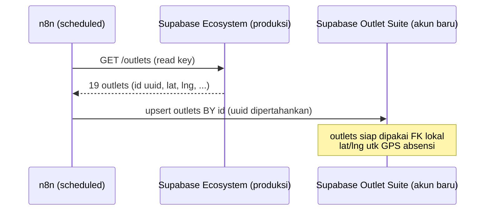
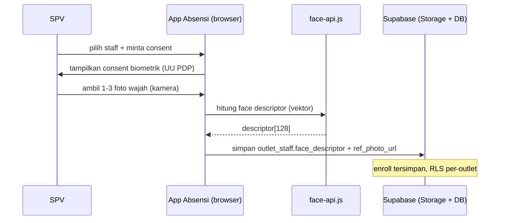
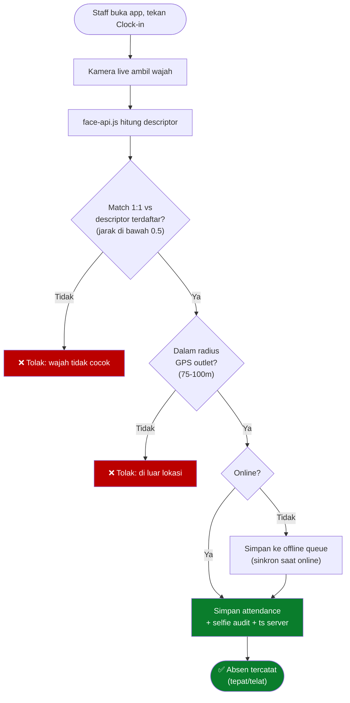
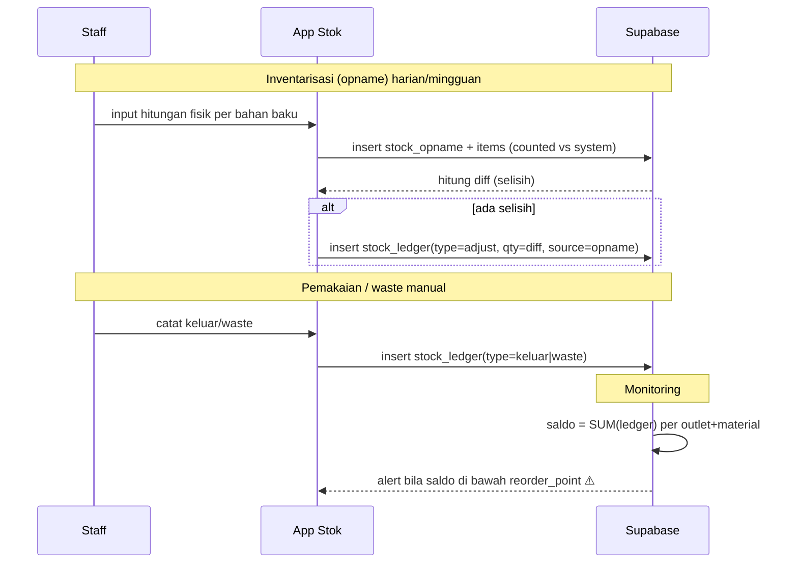
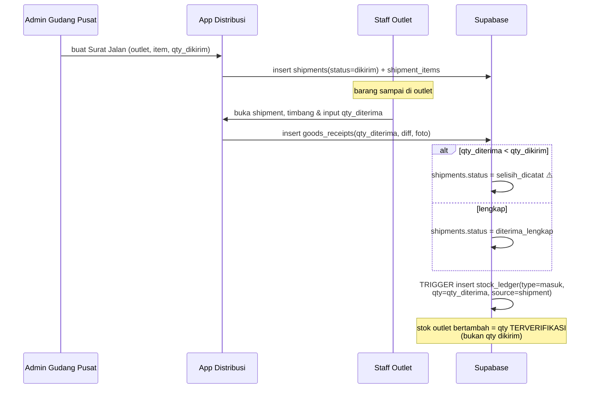
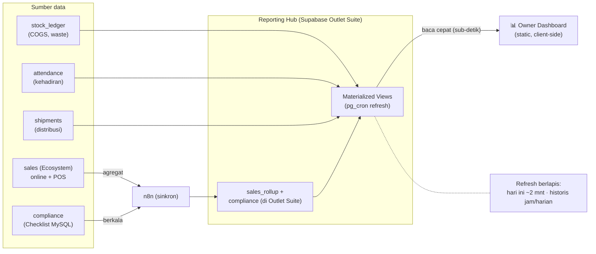
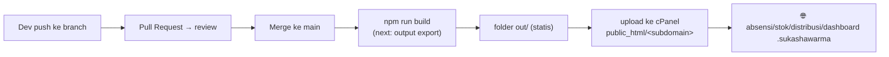

# Flows — Alur Proses Outlet Suite

Diagram alur tiap proses kunci (Mermaid, render di GitHub).
Lihat juga: [`ARCHITECTURE.md`](ARCHITECTURE.md) · [`PRD.md`](PRD.md)

---

## 1. Sinkron `outlets` (Ecosystem → Outlet Suite) — M0

---

## 2. Enroll Wajah Staff (M1) — oleh SPV

---

## 3. Clock-in dengan Face Matching + GPS (M1)

---

## 4. Stock Opname & Ledger (M2)

---

## 5. Supply Chain: Surat Jalan → Verifikasi → Stok Masuk (M3→M2)

> **Contoh:** kirim 50kg → outlet terima 48kg → discrepancy 2kg dicatat, stok masuk = **48kg**.

---

## 6. Owner Dashboard — Reporting Hub (M4)

---

## 7. Pola Deploy (semua app, static export)

