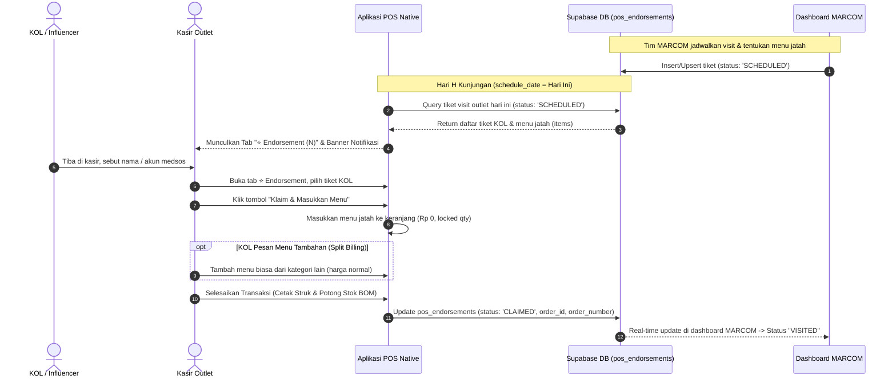

# 📋 DOKUMEN HANDOVER SPESIFIKASI TEKNIS
## Integrasi Menu & Kunjungan Endorsement KOL (MARCOM ↔ POS Kasir Native)

**Target Pembaca:** Tim Pengembang Aplikasi POS Native (Android Tablet / Kotlin / Flutter / React Native)  
**Versi Dokumen:** 1.0.0  
**Tanggal Rilis:** 16 September 2026  
**Status Backend & Database:** ✅ Selesai & Aktif di Supabase Production (`khpkoreaaucvyqfhynfq.supabase.co`)

---

## 1. Latar Belakang & Tujuan Fitur

Tim Marketing & Communication (MARCOM) kini telah memiliki sistem penjadwalan terpadu untuk influencer/KOL (*Key Opinion Leader*). Pada sistem ini, tim MARCOM:
1. Menjadwalkan tanggal kunjungan fisik (*visit*) KOL ke cabang tertentu.
2. Menentukan **menu jatah endorsement** yang boleh diambil oleh KOL langsung dari master katalog menu POS (harga jatah otomatis **Rp 0**).

Tugas aplikasi **POS Kasir Native** di tablet outlet adalah:
- Mendeteksi jadwal kunjungan KOL yang ditugaskan ke cabang tersebut pada **hari H**.
- Memunculkan kategori khusus **`⭐ Endorsement`** di jajaran kategori menu kasir.
- Memasukkan menu jatah KOL ke keranjang belanja kasir seharga **Rp 0** (jatah gratis).
- Mendukung mekanisme **Split Billing** jika KOL memesan menu tambahan di luar jatah (menu tambahan dihitung harga normal).
- Memperbarui status tiket menjadi **`CLAIMED`** beserta nomor struk kasir saat transaksi diselesaikan.

---

## 2. Diagram Alur Transaksi (Flowchart)



---

## 3. Spesifikasi Database & Tabel Supabase

Seluruh data tiket endorsement disimpan di tabel master Supabase POS:
**Nama Tabel:** `pos_endorsements`

### Skema Kolom:

| Nama Kolom | Tipe Data | Nullable | Keterangan |
|---|---|---|---|
| `id` | `UUID` | NO | Primary Key unik untuk tiket endorsement |
| `marcom_endorsement_id` | `BIGINT` | NO | ID unik referensi dari database MARCOM (UNIQUE) |
| `outlet_id` | `UUID` | NO | Foreign Key ke `outlets.id` (ID cabang tujuan visit) |
| `outlet_name` | `TEXT` | NO | Nama cabang (e.g. `SUKA SHAWARMA BNR`) |
| `kol_id` | `BIGINT` | YES | ID profil KOL di MARCOM |
| `kol_name` | `TEXT` | NO | Nama lengkap / panggung KOL |
| `kol_handle` | `TEXT` | YES | Akun medsos (e.g. `IG: @sarah_kuliner \| TT: @sarah.foodie`) |
| `kol_phone` | `TEXT` | YES | No WhatsApp/kontak KOL untuk verifikasi kasir |
| `schedule_date` | `DATE` | NO | Tanggal kunjungan (format: `YYYY-MM-DD`) |
| `items` | `JSONB` | NO | Array daftar menu jatah beserta kuantitas porsinya |
| `status` | `TEXT` | NO | Nilai: `'SCHEDULED'`, `'CLAIMED'`, `'EXPIRED'`, `'CANCELLED'` |
| `claimed_at` | `TIMESTAMPTZ` | YES | Waktu kasir menyelesaikan klaim di POS |
| `order_id` | `UUID` | YES | ID transaksi pesanan di tabel `orders.id` |
| `pos_order_number` | `INT` | YES | Nomor antrean / nomor order struk kasir |
| `notes` | `TEXT` | YES | Catatan briefing / instruksi khusus dari tim MARCOM |

### Contoh Struktur Data Kolom `items` (JSONB):
```json
[
  {
    "id": "550e8400-e29b-41d4-a716-446655440010",
    "name": "Shawarma Beef Large",
    "price": 35000,
    "quantity": 2,
    "category_name": "Makanan"
  },
  {
    "id": "550e8400-e29b-41d4-a716-446655440020",
    "name": "Es Teh Manis",
    "price": 6000,
    "quantity": 2,
    "category_name": "Minuman"
  }
]
```

---

## 4. Panduan Implementasi Langkah demi Langkah (Native POS)

### Langkah 1: Query Tiket Hari Ini saat Kasir Membuka Layar Kasir
Gunakan query Supabase SDK atau REST API berikut saat aplikasi kasir memuat data:

```sql
SELECT 
  id,
  marcom_endorsement_id,
  outlet_id,
  outlet_name,
  kol_name,
  kol_handle,
  kol_phone,
  schedule_date,
  items,
  status,
  notes
FROM pos_endorsements
WHERE outlet_id = :CURRENT_OUTLET_ID
  AND schedule_date = CURRENT_DATE
  AND status = 'SCHEDULED'
ORDER BY created_at ASC;
```

> **Catatan:** Lakukan re-fetch atau pasang Supabase Realtime Subscription pada tabel `pos_endorsements` jika menginginkan tiket otomatis muncul saat kasir sedang standby.

---

### Langkah 2: Logika Tampilan UI (Antarmuka Kasir)

1. **Badge / Tab Kategori Menu**:
   - Jika terdapat $\ge 1$ tiket dengan status `SCHEDULED` untuk hari ini:
     - Tambahkan kategori di jajaran tab kategori menu: **`⭐ Endorsement ({jumlah_tiket})`**.
     - Rekomendasi letak tab: di sebelah kanan kategori *Semua Menu* atau paling kiri agar kasir langsung menyadari ada jadwal KOL.
   - Jika tidak ada tiket hari ini (0 tiket), tab ini dapat disembunyikan agar layar tetap bersih.

2. **Banner Peringatan (Alert)**:
   - Jika kasir sedang berada di tab kategori lain (misal tab *Makanan*), tampilkan banner kecil di atas:  
     `"⭐ Ada {N} jadwal visit KOL hari ini! Klik tab Endorsement untuk melihat tiket."`

3. **Kartu Tiket KOL (Tiket View)**:
   Ketika kasir membuka tab **⭐ Endorsement**, tampilkan kartu tiket per KOL:
   - **Nama KOL**: Teks tebal (e.g. `Sarah Kuliner Bogor`).
   - **Handle Sosmed**: Badge platform (e.g. `IG: @sarah_bgr | TT: @sarah_eats`).
   - **Nomor Telepon**: `0812-xxxx-xxxx`.
   - **Catatan MARCOM**: Box info (e.g. *"KOL take video pembuatan shawarma di dapur mini"*).
   - **Daftar Menu Jatah**:
     - `2x Shawarma Beef Large (Gratis)`
     - `2x Es Teh Manis (Gratis)`
   - **Tombol Aksi**: **`[ Klaim & Masukkan Menu ]`** (Tombol utama).

---

### Langkah 3: Logika Keranjang (Cart Logic) & Split Billing

Ketika kasir menekan tombol **`[ Klaim & Masukkan Menu ]`**:

1. **Isi Keranjang Belanja**:
   - Kosongkan keranjang jika sedang berisi draft pesanan lain (atau konfirmasi ke kasir).
   - Iterasi array `ticket.items`:
     - Tambahkan setiap menu ke dalam keranjang.
     - Set `unit_price = 0` (gratis).
     - Tandai flag item: `is_endorse_item = true`.
     - Kunci tombol tambah/kurang kuantitas porsi khusus untuk item endorse ini agar kasir tidak dapat menambah jatah gratis secara sepihak.
   - Simpan ID tiket di state aktif transaksi: `active_endorsement_id = ticket.id`.

2. **Dukungan Split Billing (Pesanan Ekstra)**:
   - Jika KOL memesan menu tambahan (misal: ingin tambah 1 Kentang Goreng dan 1 Kopi):
     - Kasir cukup beralih ke tab menu reguler dan menambahkan menu tersebut ke keranjang.
     - Menu tambahan dihitung dengan harga normal.
   - Keranjang akan menampilkan:
     - *Shawarma Beef Large (x2)* → **Rp 0** `[⭐ Endorse]`
     - *Es Teh Manis (x2)* → **Rp 0** `[⭐ Endorse]`
     - *French Fries (x1)* → **Rp 18.000** `[Reguler]`
     - **Subtotal:** Rp 18.000
     - **Total Bayar:** Rp 18.000

---

### Langkah 4: Logika Pembayaran (Checkout)

1. **Kasus A: Total Transaksi Rp 0 (Murni Jatah Endorsement)**
   - Kasir menekan tombol bayar / selesaikan.
   - Aplikasi tidak perlu meminta input uang tunai atau QRIS.
   - Tombol berubah menjadi: **`[ Selesaikan Klaim Endorsement (Rp 0) ]`**.
   - Simpan order dengan metode bayar `'endorse'` atau `'free'` dengan `total_amount = 0`.

2. **Kasus B: Total Transaksi > Rp 0 (Ada Tambahan Berbayar)**
   - Kasir memilih metode bayar reguler (Tunai / QRIS / Kartu Debit) hanya untuk nominal selisihnya (misal: Rp 18.000).

3. **Cetak Struk & Pemotongan Bahan Baku (BOM)**:
   - Cetak struk pesanan untuk dapur (*kitchen ticket*) dan struk pelanggan seperti biasa.
   - Pada struk tercetak:
     ```text
     ========================================
             SUKA SHAWARMA - BNR
     ========================================
     Order: #108 (KOL: Sarah Kuliner Bogor)
     Tipe : ⭐ ENDORSEMENT VISIT
     ----------------------------------------
     2x Shawarma Beef Large           Rp 0
        (Jatah Endorse MARCOM)
     2x Es Teh Manis                  Rp 0
        (Jatah Endorse MARCOM)
     1x French Fries               Rp 18.000
     ----------------------------------------
     Total Tagihan                 Rp 18.000
     Metode: QRIS                  Rp 18.000
     Kembalian                          Rp 0
     ========================================
     ```
   - Sistem inventori/BOM kasir memotong stok bahan baku seperti order biasa (Shawarma memotong kulit, daging, saus, dsb.).

---

### Langkah 5: Finalisasi & Update Status Tiket di Supabase

Setelah record transaksi di tabel `orders` berhasil disimpan dan mendapatkan `order_id` serta `order_number`:

Perbarui baris tiket di tabel `pos_endorsements`:

```sql
UPDATE pos_endorsements
SET 
  status = 'CLAIMED',
  claimed_at = NOW(),
  order_id = :ORDER_ID,
  pos_order_number = :ORDER_NUMBER
WHERE id = :ACTIVE_ENDORSEMENT_ID;
```

> **Alternatif REST API:**  
> Jika POS Native mengirim order melalui endpoint Next.js backend web (`POST /api/orders/walk-in`), sertakan property `"pos_endorsement_id": active_endorsement_id` pada JSON body request. Backend sudah otomatis meng-update tabel `pos_endorsements` dan mengisi nomor order.

---

## 5. Penanganan Kasus Khusus (Edge Cases)

| Skenario | Solusi yang Diharapkan |
|---|---|
| **KOL datang sebelum / sesudah tanggal jadwal** | POS hanya menampilkan jadwal untuk `CURRENT_DATE`. Jika KOL datang di hari berbeda, kasir dapat melihat tab riwayat atau menghubungi tim MARCOM untuk mengubah tanggal jadwal di dashboard. |
| **KOL membatalkan kunjungan** | Tim MARCOM dapat mengubah status menjadi `CANCELLED`. Tiket otomatis hilang dari tampilan kasir. |
| **Menu jatah sedang habis stok (out of stock) di outlet** | Berikan notifikasi alert kepada kasir. Kasir dapat berkoordinasi dengan KOL untuk menukar dengan menu yang setara (tim MARCOM dapat mengedit detail jatah menu secara real-time dari dashboard). |
| **Mode Offline Kasir** | Jika tablet kasir offline saat klaim, simpan status klaim di antrean lokal (SQLite/WatermelonDB/Room) dan lakukan sync ke Supabase saat koneksi internet kembali pulih. |

---

## 6. Verifikasi & Pengujian (Testing Guide)

Developer POS Native dapat menggunakan contoh payload tiket uji coba berikut di Supabase untuk menguji tampilan:

```sql
-- Insert dummy tiket endorsement untuk pengujian outlet BNR
INSERT INTO pos_endorsements (
  marcom_endorsement_id,
  outlet_id,
  outlet_name,
  kol_name,
  kol_handle,
  kol_phone,
  schedule_date,
  items,
  status,
  notes
) VALUES (
  99999,
  '550e8400-e29b-41d4-a716-446655440001', -- UUID Cabang BNR
  'SUKA SHAWARMA BNR',
  'Tester Food Vlogger',
  'IG: @test_vlogger | TT: @test_food',
  '081234567890',
  CURRENT_DATE,
  '[
    {"id": "test-1", "name": "Shawarma Chicken Regular", "price": 25000, "quantity": 1, "category_name": "Makanan"},
    {"id": "test-2", "name": "Lemon Tea", "price": 10000, "quantity": 1, "category_name": "Minuman"}
  ]'::jsonb,
  'SCHEDULED',
  'Uji coba integrasi tiket POS Native'
);
```

Setelah pengujian selesai, baris uji coba dapat dihapus:
```sql
DELETE FROM pos_endorsements WHERE marcom_endorsement_id = 99999;
```

---

## 7. Kontak & Dukungan
Jika tim pengembang POS Native memiliki pertanyaan terkait skema kolom, UUID cabang, atau perilaku data flow, silakan hubungi tim MARCOM Tech / Backend. Dokumen ini dapat diperbarui sesuai kebutuhan arsitektur native.
