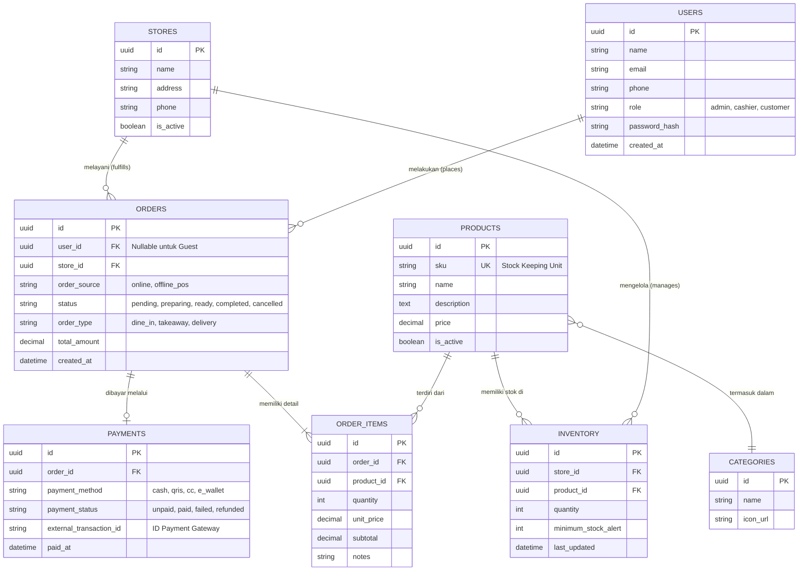

# Desain Arsitektur Lengkap Sistem POS (Point of Sales) Terintegrasi

Dokumen ini merangkum seluruh aspek teknis sistem POS berskala industri ke dalam satu tempat. Mulai dari kebutuhan desain (Requirements), Arsitektur *Microservices*, Alur Pemesanan (*Flowchart*), hingga desain Database (*ERD*). Sistem ini dirancang untuk beroperasi secara omni-channel (Online dan Offline toko) dengan mengedepankan keamanan dan stabilitas tinggi (High Availability).

---

## 1. Kebutuhan Desain Arsitektur (Architecture Design Requirements)

Membangun arsitektur tingkat industri membutuhkan enam pilar utama perancangan sistem:

### 1.1. Analisis Kebutuhan Bisnis (Business Requirements)
- **Multi-Tenant & Multi-Branch:** Mendukung banyak toko/cabang sekaligus dalam satu platform terpusat.
- **Offline Capabilities:** POS fisik bisa bertransaksi tanpa internet dan mensinkronisasikan datanya saat koneksi pulih (*offline-first design*).
- **Omnichannel:** Penyatuan inventaris dan transaksi penjualan offline, e-commerce mandiri, dan agregator logistik.

### 1.2. Kebutuhan Non-Fungsional (Non-Functional Requirements)
- **Scalability:** Sistem tangguh menghadapi lonjakan traffic (auto-scaling pada jam padat). 
- **High Availability (99.99% Uptime):** Arsitektur tanpa titik kegagalan tunggal (*no single point of failure*).
- **Low Latency:** Kecepatan operasional kasir wajib di bawah 1 detik untuk menghindari antrean.
- **Data Consistency:** Mitigasi *race condition* (mencegah stok minus saat banyak yang membeli barang sisa 1 secara serentak).

### 1.3. Pemilihan Teknologi (Technology Stack)
- **Frontend (POS & Web):** React/Next.js dengan PWA agar bisa diakses cepat dan *cacheable*.
- **Mobile (Customer App):** Flutter atau React Native.
- **Backend API:** Golang atau Node.js (Express/NestJS) untuk backend microservices.
- **Database:** PostgreSQL (Relational SQL), Redis (Session & Caching), Elasticsearch (Mesin pencari produk & katalog).

### 1.4. Arsitektur Keamanan (Security)
- **PCI-DSS Compliance:** Enkripsi standar global karena memproses sistem pembayaran (*Payment Gateway*).
- **Data Encryption:** TLS/HTTPS (In-Transit) dan enkripsi level database (At-Rest).
- **RBAC (Role-Based Access Control):** Pemisahan hak guna spesifik antara kasir, koki, manajer, dan *superadmin*.

### 1.5. Infrastruktur & DevOps (Deployment Strategy)
- **Containerization & Orchestration:** Menggunakan Docker yang diatur oleh Kubernetes (K8s).
- **CI/CD Pipeline:** Menggunakan GitHub Actions atau GitLab CI untuk *Zero-Downtime Deployment*.

### 1.6. Observabilitas (Monitoring & Observability)
- **Logging & Monitoring:** ELK Stack (Elasticsearch, Logstash, Kibana) / Datadog.
- **Alerting:** Prometheus, Grafana, & PagerDuty (Memicu pesan instan/telepon jika server bermasalah).

---

## 2. Diagram Arsitektur (Architecture Diagram)

Sistem menggunakan Arsitektur Microservices (*Event-Driven*) agar modul seperti Order, Inventory, dan Payment bisa diperbesar kapasitasnya secara independen.

```mermaid
flowchart TB
    %% Users
    Customer([Online Customer])
    Cashier([Cashier / POS Staff])
    Manager([Store Manager / Admin])

    %% Client Applications
    subgraph Clients["Client Layer (Frontend)"]
        POSApp["📱 POS Application\n(Web/Tablet/Mobile)"]
        OnlineOrder["🌐 Online Ordering\n(Web App / Mobile App)"]
        AdminDashboard["💻 Admin Dashboard\n(Backoffice Web)"]
    end

    %% External Systems
    subgraph External["External Integrations"]
        PaymentGateway["💳 Payment Gateway\n(Stripe / Midtrans / Xendit)"]
        Delivery["🛵 Delivery Partners\n(Grab / Gojek)"]
        ERP["🏢 ERP / Accounting\n(SAP / Odoo / Xero)"]
    end

    %% API Gateway
    APIGateway{{"🛡️ API Gateway & Load Balancer\n(Kong / AWS API Gateway)"}}
    CDN["🌍 CDN & WAF\n(Cloudflare)"]

    %% Microservices
    subgraph Services["Core Microservices (Backend)"]
        AuthService["🔐 Auth & IAM Service"]
        OrderService["🛒 Order Management Service"]
        InventoryService["📦 Inventory & Catalog Service"]
        PaymentService["💵 Payment Processing Service"]
        NotificationService["🔔 Notification Service"]
        CRMService["👥 CRM & Loyalty Service"]
        ReportService["📊 Analytics & Reporting"]
    end

    %% Event Bus
    MessageBroker{{"⚡ Event Bus / Message Broker\n(Apache Kafka / RabbitMQ)"}}

    %% Data Layer
    subgraph DataLayer["Data Layer"]
        MainDB[(Primary Database\nPostgreSQL)]
        CacheDB[(Cache & Session\nRedis)]
        SearchDB[(Search Engine\nElasticsearch)]
        DataWarehouse[(Data Warehouse\nBigQuery)]
    end

    %% Connections
    Customer --> CDN
    Cashier --> CDN
    Manager --> CDN

    CDN --> OnlineOrder
    CDN --> POSApp
    CDN --> AdminDashboard

    OnlineOrder --> |HTTPS/REST| APIGateway
    POSApp --> |HTTPS/REST| APIGateway
    AdminDashboard --> |HTTPS/REST| APIGateway

    APIGateway --> AuthService
    APIGateway --> OrderService
    APIGateway --> InventoryService
    APIGateway --> PaymentService
    APIGateway --> NotificationService
    APIGateway --> CRMService
    APIGateway --> ReportService

    OrderService -.-> |Event: Order Created| MessageBroker
    InventoryService -.-> |Event: Stock Updated| MessageBroker
    PaymentService -.-> |Event: Payment Success| MessageBroker
    CRMService -.-> |Event: Loyalty Points| MessageBroker
    ReportService -.-> |Consume all events| MessageBroker

    AuthService --> MainDB
    OrderService --> MainDB
    OrderService --> CacheDB
    InventoryService --> MainDB
    InventoryService --> CacheDB
    InventoryService --> SearchDB
    CRMService --> MainDB
    ReportService --> DataWarehouse
    
    PaymentService <--> PaymentGateway
    OrderService <--> Delivery
    NotificationService --> Customer
    ReportService -.-> ERP

    classDef db fill:#f9f6e5,stroke:#d4c46c,stroke-width:2px,color:#333;
    classDef ext fill:#e5f5f9,stroke:#66c2a5,stroke-width:2px,color:#333;
    classDef svc fill:#e5e5f9,stroke:#8da0cb,stroke-width:2px,color:#333;
    classDef gateway fill:#fdf0d5,stroke:#f0a868,stroke-width:2px,color:#333;
    
    class MainDB,CacheDB,SearchDB,DataWarehouse db;
    class PaymentGateway,Delivery,ERP ext;
    class AuthService,OrderService,InventoryService,PaymentService,NotificationService,CRMService,ReportService svc;
    class APIGateway,MessageBroker gateway;
```



---

## 3. Flowchart Proses Pemesanan (Order Processing Flow)

Flowchart integrasi sistem kasir toko (offline) dan pelanggan daring (online) yang berbagi inventaris yang sama secara *real-time*.

```mermaid
flowchart TD
    Start([Mulai Transaksi]) --> Source{Sumber Pesanan?}
    
    %% Alur POS Fisik
    Source -->|Toko Fisik / POS Kasir| ScanItem[Kasir Scan Barcode / Input Produk]
    ScanItem --> CheckStockOffline{Stok di DB Tersedia?}
    CheckStockOffline -->|Tidak| RejectOffline[Notifikasi ke Kasir: Stok Habis]
    CheckStockOffline -->|Ya| CartOffline[Masukkan ke Keranjang POS]
    CartOffline --> MoreItemsOffline{Tambah Item Lain?}
    MoreItemsOffline -->|Ya| ScanItem
    MoreItemsOffline -->|Tidak| PayOffline[Pilih Metode Pembayaran di Kasir]
    
    %% Alur Online
    Source -->|Online Ordering App| BrowseItem[Pelanggan Pilih Produk di App]
    BrowseItem --> CheckStockOnline{Stok di DB Tersedia?}
    CheckStockOnline -->|Tidak| RejectOnline[Tombol Beli Disable]
    CheckStockOnline -->|Ya| CartOnline[Masukkan ke Keranjang Online]
    CartOnline --> MoreItemsOnline{Tambah Item Lain?}
    MoreItemsOnline -->|Ya| BrowseItem
    MoreItemsOnline -->|Tidak| Checkout[Pelanggan Masuk Halaman Checkout]
    Checkout --> PayOnline[Pilih Metode Pembayaran]

    %% Proses Pembayaran
    PayOffline --> ProcessPayment[Proses Transaksi Pembayaran]
    PayOnline --> ProcessPayment
    
    ProcessPayment --> PaymentSuccess{Pembayaran Berhasil?}
    PaymentSuccess -->|Tidak| FailPayment[Transaksi Gagal / Menunggu Dibayar]
    FailPayment -.-> ProcessPayment
    
    PaymentSuccess -->|Ya| GenerateInvoice[Sistem Menerbitkan Invoice & E-Struk]
    
    %% Pasca Pembayaran
    GenerateInvoice --> ReduceStock[Sistem Otomatis Mengurangi Stok (Inventory)]
    ReduceStock --> UpdateStatus[Update Status Pesanan 'Preparing']
    
    UpdateStatus --> KitchenDisplay[Muncul di Layar Dapur / KDS]
    KitchenDisplay --> FoodReady{Pesanan Selesai Disiapkan?}
    
    FoodReady -->|Belum| KitchenDisplay
    FoodReady -->|Ya| ReadyStatus[Koki Tekan Selesai, Status 'Ready']
    
    ReadyStatus --> DeliveryCheck{Tipe Pengiriman?}
    DeliveryCheck -->|Dine-In / Takeaway| Handover[Antarkan ke Meja / Panggil Pelanggan]
    DeliveryCheck -->|Online Delivery| CallCourier[Sistem Panggil Kurir (Gojek/Grab)]
    
    CallCourier --> WaitCourier{Kurir Datang?}
    WaitCourier -->|Belum| WaitCourier
    WaitCourier -->|Ya| HandoverCourier[Serahkan Pesanan ke Kurir]
    
    Handover --> Finish([Transaksi Selesai & Laporan Terupdate])
    HandoverCourier --> Finish
```

---

## 4. Entity Relationship Diagram (ERD) - Database Inti

Struktur tabel *Relational Database* sistem POS dengan relasi entitas inti untuk transaksi dan pendataan master.


