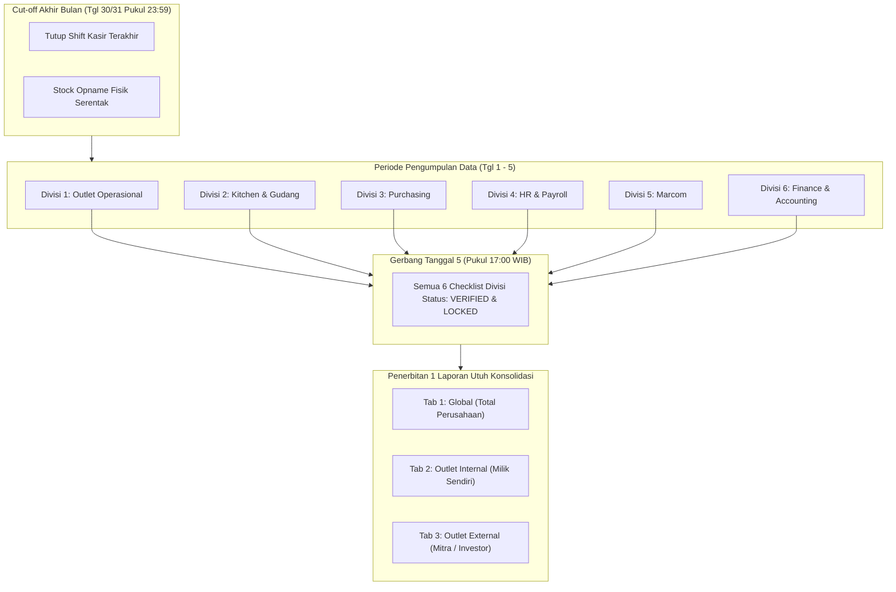

# PANDUAN PENUTUPAN BUKU AKHIR BULAN (EOM CLOSING) & MASTER REPORTING SUKA SHAWARMA

Dokumen ini adalah **pedoman resmi operasional dan finansial** untuk penutupan buku akhir bulan (*End-of-Month Closing*) jaringan restoran **Suka Shawarma**. Sistem ini memastikan seluruh data operasional, stok, kas, dan biaya terekonsiliasi rapi dari **6 divisi** sebelum disatukan menjadi **1 Laporan Konsolidasi Utuh** yang terbagi dalam 3 pilar: **Global**, **Outlet Internal**, dan **Outlet External (Mitra)**.

---

## 1. Prinsip Utama & Siklus Tutup Bulan



### Golden Rules Tutup Buku Suka Shawarma:
1. **Cut-off Waktu:** Tanggal 30/31 bulan berjalan, pukul **23:59 WIB** (setelah closing shift outlet terakhir selesai).
2. **Hard Deadline:** **Tanggal 5 bulan berikutnya pukul 17:00 WIB** seluruh divisi **wajib 100% selesai**. *"Lebih cepat lebih bagus."*
3. **No Unreconciled Variance:** Selisih kas, selisih stok (shrinkage), dan selisih settlement aggregator tidak boleh diabaikan atau digantung tanpa berita acara tertulis.
4. **Pemisahan 3 Entitas Laporan:**
   - **Global:** Performa total bisnis untuk Owner & Top Management.
   - **Outlet Internal:** Performa toko milik pusat (beban & profitabilitas riil perusahaan).
   - **Outlet External:** Performa toko mitra (dasar bagi hasil investor & perhitungan royalti/supply fee).

---

## 2. Checklist & Data Wajib Akhir Bulan per Divisi (6 Divisi)

Setiap penanggung jawab divisi (PIC) wajib melengkapi berkas data berikut sebelum batas akhir tanggal 5:

### Divisi 1: Operasional Outlet & Kasir (Store Operations)
* **PIC:** Leader Outlet (masing-masing cabang)  
* **Verifikator:** SPV Operasional  
* **Fokus:** Penjualan kasir, fisik uang kas, kas kecil outlet, dan integritas transaksi.

| No | Item Data Wajib | Deskripsi & Bukti Pendukung | Status Validasi |
|:--:|---|---|:---:|
| 1.1 | **Rekap Blind Close & Shift Kasir** | Laporan rekonsiliasi tutup shift seluruh kasir selama 1 bulan. Tidak boleh ada shift yang masih berstatus `open`. | `Wajib` |
| 1.2 | **Laporan Selisih Kas (Cash Over/Short)** | Log `variance` uang fisik vs sistem. Jika ada selisih minus, wajib melampirkan Berita Acara & pertanggungjawaban kasir. | `Wajib` |
| 1.3 | **Slip Setoran Tunai Bank (Bank Deposit)** | Seluruh uang penjualan tunai telah disetorkan ke rekening bank penampung pusat. Melampirkan foto struk ATM / slip setoran teller. | `Wajib` |
| 1.4 | **Rekap Buku Kas Kecil Outlet (Petty Cash Drawer)** | Rincian pengeluaran darurat laci kasir (beli es batu, gas darurat, perlengkapan sanitasi) yang wajib disertai **struk/nota fisik asli**. | `Wajib` |
| 1.5 | **Log Void & Refund Transaksi** | Rekap seluruh transaksi yang dibatalkan (*void*) atau di-*refund* beserta alasan dan otorisasi supervisor/leader. | `Wajib` |
| 1.6 | **Berita Acara Kerusakan Alat / Aset Outlet** | Laporan kondisi aset (kompor shawarma, chiller, tablet POS, printer thermal). | `Pelengkap` |

---

### Divisi 2: Kitchen & Gudang / Logistik (Inventory & Central Kitchen)
* **PIC:** Staff Gudang Pusat & Kepala Kitchen  
* **Verifikator:** SPV Kitchen  
* **Fokus:** Akurasi stok fisik, selisih hilang (shrinkage), sisa terbuang (waste), dan kelancaran surat jalan.

| No | Item Data Wajib | Deskripsi & Bukti Pendukung | Status Validasi |
|:--:|---|---|:---:|
| 2.1 | **Berita Acara Stock Opname (SO) Akhir Bulan** | Hasil hitung fisik serentak (ayam, kulit pita, mayones, rempah, lettuce, packaging) di **19 outlet + Gudang Pusat** per tgl 30/31 malam. | `Wajib` |
| 2.2 | **Laporan Selisih Stok (Shrinkage / Selisih Hilang)** | Perbandingan Stok Sistem vs Fisik. Menampilkan nominal kerugian (Rp) dari bahan baku yang hilang/tidak teridentifikasi. | `Wajib` |
| 2.3 | **Laporan Kerugian Waste & Afkir (Food Waste)** | Data bahan baku rusak, basi, gosong, atau jatuh, lengkap dengan berat/qty dan valuasi rupiah kerugiannya. | `Wajib` |
| 2.4 | **Rekap Surat Jalan (Fulfillment Inflow/Outflow)** | Seluruh surat jalan distribusi bahan antar gudang ke outlet harus berstatus `Diterima / Selesai`. **Nol surat jalan gantung (pending)**. | `Wajib` |
| 2.5 | **Rekap Retur Bahan Baku** | Bukti retur bahan baku yang cacat/rusak kembali ke vendor atau kembali ke gudang pusat. | `Wajib` |

---

### Divisi 3: Purchasing / Pengadaan
* **PIC:** Purchasing Officer  
* **Verifikator:** Manager Purchasing / Finance  
* **Fokus:** Tagihan vendor, penerimaan barang, dan pengendalian harga bahan baku.

| No | Item Data Wajib | Deskripsi & Bukti Pendukung | Status Validasi |
|:--:|---|---|:---:|
| 3.1 | **Rekap 3-Way Matching PO - GRN - Invoice** | Pencocokan antara Surat Pesanan (PO), Surat Penerimaan Barang dari Gudang (GRN), dan Faktur Tagihan dari Vendor. | `Wajib` |
| 3.2 | **Laporan Hutang Dagang (Accounts Payable / AP Aging)** | Daftar seluruh tagihan supplier yang sudah jatuh tempo dan yang belum dibayar per tanggal cut-off akhir bulan. | `Wajib` |
| 3.3 | **Laporan Deviasi Harga Bahan Baku** | Catatan fluktuasi harga beli bahan pokok (misal kenaikan harga daging ayam segar, minyak goreng, atau bumbu impor) terhadap harga standar. | `Wajib` |
| 3.4 | **Laporan Evaluasi Vendor & Lead Time** | Rekap performa ketepatan waktu pengiriman dan kualitas barang supplier. | `Pelengkap` |

---

### Divisi 4: HR & Personalia (Human Resources & Payroll)
* **PIC:** Admin HR  
* **Verifikator:** SPV HR / Head of People  
* **Fokus:** Gaji karyawan, absensi, lembur, kasbon, dan bonus omzet outlet.

| No | Item Data Wajib | Deskripsi & Bukti Pendukung | Status Validasi |
|:--:|---|---|:---:|
| 4.1 | **Rekap Absensi Bulanan Final** | Rekapitulasi kehadiran 100% tuntas (hadir, sakit surat dokter, izin, cuti, telat, dan mangkir/alpha) seluruh kru dan staf. | `Wajib` |
| 4.2 | **Rekap Lembur (Overtime) Tervalidasi** | Jam lembur kru yang sudah ditandatangani dan diverifikasi oleh Leader Outlet & SPV. | `Wajib` |
| 4.3 | **Perhitungan Bonus Performa Crew Outlet** | Perhitungan insentif berbasis pencapaian target omzet outlet harian/bulanan sesuai skema KPI Suka Shawarma. | `Wajib` |
| 4.4 | **Rekap Potongan Kasbon / Pinjaman Staf** | Daftar cicilan pinjaman atau denda pelanggaran yang memotong slip gaji bulan berjalan. | `Wajib` |
| 4.5 | **Register Payroll Final (Beban Gaji)** | Rekapitulasi total nilai transfer gaji bersih (*take home pay*) terpisah per outlet internal, outlet external, dan kantor pusat. | `Wajib` |

---

### Divisi 5: Marketing & Komunikasi (Marcom)
* **PIC:** Marcom Specialist / Digital Marketer  
* **Verifikator:** Marketing Lead / Management  
* **Fokus:** Biaya iklan berbayar, promosi aggregator, influencer/KOL, dan return on ad spend (ROAS).

| No | Item Data Wajib | Deskripsi & Bukti Pendukung | Status Validasi |
|:--:|---|---|:---:|
| 5.1 | **Rekap Pengeluaran Iklan Digital (Ad Spend)** | Laporan invoice resmi Meta Ads (Instagram/FB), TikTok Ads, dan Google Ads yang dibebankan selama bulan laporan. | `Wajib` |
| 5.2 | **Rekap Biaya Endorsement & Food Vlogger** | Laporan pembayaran jasa review/influencer, kelengkapan link postingan, dan status pelunasan honorarium. | `Wajib` |
| 5.3 | **Rekap Biaya Promosi Cetak & POSM** | Pengeluaran untuk cetak banner outlet, brosur promosi, kemasan edisi khusus, atau neon box. | `Wajib` |
| 5.4 | **Laporan Efektivitas Kampanye Promosi** | Analisis pertumbuhan omzet (*sales uplift*) per channel penjualan (Grab, Gojek, Shopee, TikTok Shop) pasca-program promosi. | `Pelengkap` |

---

### Divisi 6: Finance & Accounting (Fasilitator & Pengunci)
* **PIC:** Admin Finance & Accounting Lead  
* **Verifikator:** Finance Director / Owner  
* **Fokus:** Rekonsiliasi bank, settlement online food aggregator, audit pengeluaran, dan penutupan buku.

| No | Item Data Wajib | Deskripsi & Bukti Pendukung | Status Validasi |
|:--:|---|---|:---:|
| 6.1 | **Rekonsiliasi Bank 100% (Bank Reconciliation)** | Seluruh mutasi rekening koran (BCA, Mandiri, BRI, dll.) telah dipetakan ke buku kas/jurnal. Saldo buku bank = Saldo rekening koran riil. | `Wajib` |
| 6.2 | **Rekonsiliasi Settlement Online Food Aggregator** | Rekap pencairan dari GoFood, GrabFood, ShopeeFood, dan TikTok Go: mencocokkan Gross Sales, Komisi Platform (~20%), Biaya Promo, dan **Net Dana Cair**. | `Wajib` |
| 6.3 | **Rekapitulasi Biaya Operasional Kantor Pusat & Sewa** | Pencatatan beban sewa outlet bulanan/amortisasi, listrik, air, internet (Indihome/Biznet), perizinan, dan software subscription. | `Wajib` |
| 6.4 | **Audit Pajak Restoran (PB1) & Pajak Usaha** | Perhitungan setoran pajak daerah PB1/resto (bila ada) dan PPh Final 0.5% UMKM. | `Wajib` |
| 6.5 | **Penetapan Nilai Aset Persediaan Akhir** | Penguncian nilai moneter persediaan stok bahan baku di neraca berdasarkan hasil Stock Opname Divisi Kitchen. | `Wajib` |

---

## 3. Timeline Eksekusi: SOP Tanggal 1 s.d. 5

```mermaid
gantt
    title Jadwal Operasional EOM Closing Suka Shawarma
    dateFormat  YYYY-MM-DD
    section Persiapan & Cut-off
    Audit Awal & Persiapan Formulir SO       :done,    des1, 2026-09-28, 2d
    Cut-off Shift Kasir & Opname Serentak    :active,  des2, 2026-09-30, 1d
    section Pengumpulan Data Divisi
    Divisi 1: Outlet - Kas & Shift Final     :         des3, 2026-10-01, 2d
    Divisi 2: Kitchen - SO & Shrinkage Data  :         des4, 2026-10-01, 2d
    Divisi 3: Purchasing - Tagihan & PO     :         des5, 2026-10-02, 2d
    Divisi 4: HR - Absensi, Bonus, Payroll   :         des6, 2026-10-02, 2d
    Divisi 5: Marcom - Rekap Ads & Endorse   :         des7, 2026-10-03, 1d
    Divisi 6: Finance - Rekon Bank & Online  :         des8, 2026-10-03, 2d
    section Konsolidasi & Rilis
    HARD DEADLINE TGL 5 - Lock Semua Divisi  :crit,    des9, 2026-10-05, 1d
    Penerbitan 1 Laporan Utuh Konsolidasi    :milestone, des10, 2026-10-05, 0d
```

### Rincian Tindakan Harian:
* **H-2 (Tgl 28/29):** Finance mengirimkan memo pengingat persiapan formulir SO fisik ke seluruh Leader Outlet dan Kitchen.
* **Hari H (Tgl 30/31 malam):** Pukul 22:00–23:59 kasir melakukan *Blind Close*. SPV & tim dapur melakukan hitung fisik bahan baku.
* **Tanggal 1:** Leader Outlet menuntaskan input setoran tunai dan kas kecil. SPV Kitchen menginput angka stok opname ke sistem.
* **Tanggal 2:** Purchasing mencocokkan invoice vendor. HR mengunci rekap absensi dan menghitung draf bonus outlet.
* **Tanggal 3:** Kitchen merilis angka kerugian waste & shrinkage. Marcom mengirimkan invoice Meta Ads & kontrak influencer.
* **Tanggal 4:** Finance menyelesaikan rekonsiliasi bank dan perhitungan HPP riil per outlet.
* **Tanggal 5 (Maksimal Pukul 17:00 WIB):** Seluruh status checklist divisi dikunci (`LOCKED`). Sistem mengagregasi data menjadi **1 Laporan Utuh Konsolidasi**.

---

## 4. Standar Format "1 Laporan Utuh Konsolidasi" (3 Tab / Pilar)

Laporan konsolidasi akhir menyajikan Laba Rugi Komprehensif F&B dengan 3 segmentasi view:

### Struktur Format Laba Rugi F&B (P&L Standards)

```
[+] PENDAPATAN PENJUALAN (REVENUE)
    - Penjualan Kasir Offline (POS Dine-in & Takeaway)
    - Penjualan Online Catering / WhatsApp
    - Penjualan Food Apps Aggregator (GoFood, GrabFood, ShopeeFood - Gross)
    - Penjualan TikTok Go / Voucher
    - Penjualan Aplikasi Retail Suka Shawarma
    = TOTAL PENDAPATAN KOTOR (GROSS SALES)
    [-] Diskon Promosi, Voucher, & Komisi Merchant Aggregator (20%)
    = TOTAL PENDAPATAN BERSIH (NET REVENUE)

[-] HARGA POKOK PENJUALAN (COGS / HPP BAHAN BAKU)
    - Persediaan Awal Bahan Baku
    (+) Pembelian Bahan Baku Bulan Berjalan (Surat Jalan Masuk)
    [-] Persediaan Akhir Bahan Baku (Hasil Opname Fisik)
    = HPP PEMAKAIAN BAHAN BAKU RIIL
    (+) Biaya Packaging & Kemasan (Box, Kertas Shawarma, Plastik)
    (+) Kerugian Selisih Stok (Shrinkage) & Kerugian Waste (Bahan Rusak/Basi)
    = TOTAL BEBAN POKOK PENJUALAN (TOTAL COGS)

(=) LABA KOTOR (GROSS PROFIT)
    % Gross Profit Margin = (Gross Profit / Net Revenue) * 100%

[-] BEBAN OPERASIONAL TOKO (STORE OPEX)
    - Gaji & Upah Kru Outlet
    - Bonus & Insentif Performa Kru Outlet
    - Listrik, Air, Gas, & Kebersihan Outlet
    - Biaya Kas Kecil Operasional Toko (Petty Cash Outlet)
    - Pemeliharaan & Servis Peralatan Outlet
    - Beban Sewa Tempat Outlet (Alokasi Bulanan)
    = TOTAL BEBAN OPERASIONAL TOKO (STORE OPEX)

(=) KONTRIBUSI LABA OUTLET (STORE CONTRIBUTION MARGIN)
    % Store Contribution Margin = (Store Contribution Margin / Net Revenue) * 100%

[-] BEBAN PUSAT & OVERHEAD PERUSAHAAN (G&A + MARKETING)
    - Gaji Staf Manajemen & Kantor Pusat (HR, Finance, Purchasing, IT, SPV)
    - Biaya Pemasaran & Iklan (Meta Ads, TikTok Ads, Endorsement, POSM)
    - Biaya Operasional Kantor Pusat & Transportasi Distribusi
    - Biaya Server Cloud, Domain, & Langganan Software
    = TOTAL BEBAN UMUM & ADMINISTRASI PUSAT (HEAD OFFICE OVERHEAD)

(=) LABA BERSIH USAHA (NET OPERATING PROFIT / EBITDA)
    % Net Profit Margin = (Net Profit / Net Revenue) * 100%
```

---

### Segmentasi 3 Tab Laporan:

#### Tab 1: Ringkasan Global (Konsolidasi Total Perusahaan)
* Menampilkan performa gabungan dari seluruh 19 cabang + Kantor Pusat.
* Menampilkan rasio kesehatan bisnis utama F&B:
  - **Ideal COGS %:** 38% – 43%
  - **Ideal Store OPEX %:** 20% – 25%
  - **Ideal Marketing %:** 3% – 5%
  - **Target Net Margin %:** 18% – 25%
* Dilengkapi tabel **Top 3 Outlet Paling Menguntungkan** dan **Bottom 3 Outlet Perlu Perhatian Khusus**.

#### Tab 2: Outlet Internal (Toko Milik Sendiri / Pusat)
* Menampilkan breakdown per cabang internal (misal: Cabang Empang, Cabang Pajajaran, dll.).
* Menyerap seluruh biaya operasional, gaji, dan alokasi sewa toko milik sendiri.
* Angka laba bersih merupakan arus kas nyata yang masuk ke kas utama perusahaan.

#### Tab 3: Outlet External (Toko Mitra / Kemitraan / Investor)
* Menampilkan performa cabang mitra per masing-masing pemilik/investor.
* Memisahkan pos pendapatan:
  - Omzet Toko Mitra
  - HPP Pembelian Bahan Baku dari Pusat (Supply Bahan)
  - Biaya Royalti / Management Fee Suka Shawarma (bila berlaku)
* Menghitung **Laba Bersih yang Dibagikan ke Mitra (Profit Sharing)** secara transparan sesuai persentase akad kerja sama.

---

## 5. Blueprint Desain Fitur Baru di Admin Dashboard ("EOM Closing Hub")

Untuk merealisasikan pengawasan di role Admin, dashboard akan dilengkapi tab baru bernama **"Closing Akhir Bulan" (`/dashboard/admin/closing-bulanan`)**.

### Mockup Arsitektur Halaman Dashboard:

```
+---------------------------------------------------------------------------------------------------+
|  SUKA SHAWARMA ADMIN DASHBOARD - PUSAT CLOSING AKHIR BULAN                                       |
|  Periode: [ September 2026 v ]      Cut-off: 30 Sep 2026 23:59      Status: 4/6 Divisi Selesai   |
+---------------------------------------------------------------------------------------------------+
|                                                                                                   |
|  [ STATUS CHECKLIST PER DIVISI ]                                                                  |
|  -----------------------------------------------------------------------------------------------  |
|  1. Operasional Outlet  : [ ✅ COMPLETE (19/19 Outlet) ]   PIC: Leader / SPV Ops                  |
|  2. Kitchen & Gudang    : [ ✅ COMPLETE (SO & Waste Lock) ]PIC: SPV Kitchen                       |
|  3. Purchasing          : [ ⏳ PENDING (2 Invoice Belum) ] PIC: Tim Purchasing                    |
|  4. HR & Payroll        : [ ✅ COMPLETE (Slip Final) ]     PIC: Admin HR                          |
|  5. Marcom / Marketing  : [ ✅ COMPLETE (Ad Spend Rp 12M) ]PIC: Tim Marcom                        |
|  6. Finance & Rekonsiliasi: [ ⏳ IN PROGRESS (Bank Reconcile) ] PIC: Finance Lead                 |
|                                                                                                   |
|  [ ! PERINGATAN SISTEM: Tombol 'Terbitkan Master Report' akan aktif setelah ke-6 divisi COMPLETE ]|
|  [ Tombol: Review Draft Data ]                 [ Tombol: Terbitkan Laporan Konsolidasi (Locked) ] |
+---------------------------------------------------------------------------------------------------+
|                                                                                                   |
|  [ TAMPILAN LAPORAN KONSOLIDASI ]                                                                 |
|  +---------------------------+-------------------------------+---------------------------------+  |
|  |   TAB 1: GLOBAL (TOTAL)   |   TAB 2: OUTLET INTERNAL      |   TAB 3: OUTLET MITRA (EXTERNAL)|  |
|  +---------------------------+-------------------------------+---------------------------------+  |
|                                                                                                   |
|  Rangkuman Finansial:                                                                             |
|  * Gross Sales         : Rp 580.400.000                                                           |
|  * Net Revenue         : Rp 522.360.000                                                           |
|  * Total COGS (HPP)    : Rp 214.167.600  (41.0%)                                                  |
|  * Gross Profit        : Rp 308.192.400  (59.0%)                                                  |
|  * Store OPEX          : Rp 125.366.400  (24.0%)                                                  |
|  * HO & Marketing OPEX : Rp  41.788.800  ( 8.0%)                                                  |
|  * Net Profit (EBITDA) : Rp 141.037.200  (27.0%)                                                  |
|                                                                                                   |
|  [ Tombol Ekspor PDF Eksekutif ]    [ Tombol Ekspor Excel Lengkap ]    [ Tombol Cetak Dokumen ]   |
+---------------------------------------------------------------------------------------------------+
```

---

## 6. Tindakan Lanjut & Rekomendasi Implementasi

1. **Sosialisasi SOP ke 6 Divisi:** Bagikan bagian checklist bab 2 kepada masing-masing kepala divisi (Leader Outlet, SPV Kitchen, Purchasing, HR, Marcom, dan Finance) sebagai acuan penutupan buku bulan ini.
2. **Penetapan Deadline Ketat Tanggal 5:** Tegaskan batas waktu input dan penyerahan data paling lambat tanggal 5 setiap bulan pukul 17:00 WIB.
3. **Pembangunan Tab Closing EOM di Dashboard:** Mengimplementasikan halaman `Closing EOM Hub` di `apps/admin-dashboard` agar manajemen dapat memantau centang hijau progress divisi secara *real-time*.
