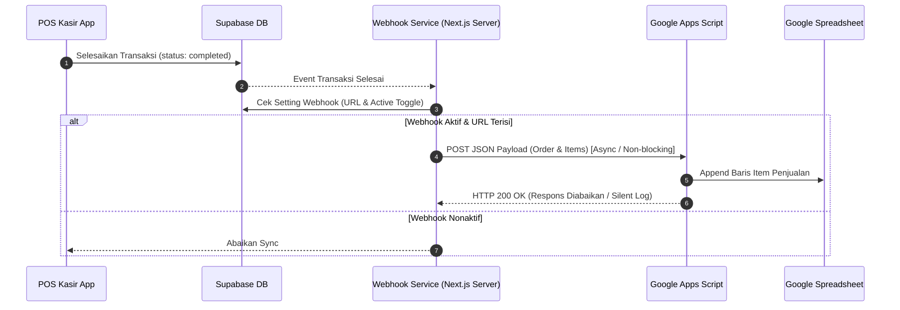

# Design Spec: Integrasi Real-Time Item Penjualan ke Google Sheets via Google Apps Script Webhook

- **Tanggal**: 22 Juli 2026
- **Status**: Draft (Menunggu Review User)
- **Topik**: Integrasi Otomatis Data Penjualan Menu / Item Per Shift ke Google Spreadsheet

---

## 1. Ringkasan & Tujuan

Pengguna membutuhkan sistem sinkronisasi otomatis data **Item Penjualan (Menu Terjual)** per transaksi secara **Real-Time** dari POS Kasir / Laporan Shift langsung masuk ke **Google Sheets** milik pengguna. 

Dengan integrasi ini:
1. Setiap kali transaksi kasir diselesaikan (status order = `completed`), item-item yang dibeli akan otomatis dikirim (append) ke Google Spreadsheet secara *real-time*.
2. Pengguna dapat dengan bebas menyesuaikan urutan/posisi kolom di Spreadsheet menggunakan templat **Google Apps Script** yang disediakan.
3. Pengaturannya (URL Webhook & Saklar ON/OFF) dapat dikelola langsung via **Admin Dashboard** tanpa perlu deploy ulang sistem.

---

## 2. Alur Kerja (Architecture & Data Flow)



---

## 3. Komponen yang Akan Dibuat / Diubah

### A. Database (Global Settings)
- Menambahkan atau memperbarui key setting pada tabel database (`global_settings`):
  - `google_sheets_webhook_url` (text): URL Google Apps Script Webhook.
  - `google_sheets_sync_enabled` (boolean): Status aktif/nonaktif sinkronisasi.

### B. Admin Dashboard Page (Halaman Pengaturan Webhook)
- **Lokasi**: Pada Halaman Laporan POS (`/dashboard/reports/pos`) atau Pengaturan Sistem.
- **Fitur UI**:
  - Input Text: URL Webhook Google Apps Script.
  - Switch Toggle: Aktifkan / Nonaktifkan Real-time Sync.
  - Tombol "Tes Koneksi Webhook": Mengirimkan data dummy transaksi untuk memastikan Google Sheet terhubung dengan baik.
  - Modal / Card "Panduan Google Apps Script": Menampilkan script templat yang tinggal di-copy paste ke Google Spreadsheet pengguna.

### C. Webhook Dispatcher Service (Backend / Helper)
- **File Baru**: `apps/admin-dashboard/src/lib/google-sheets-webhook.ts` (atau di package shared/POS).
- **Fungsi**: `sendOrderToGoogleSheets(orderId: string, items: OrderItem[])`
- **Prinsip Kinerja**:
  - **Non-blocking (Asynchronous)**: Menggunakan `fetch` background tanpa `await` pada respon kasir, sehingga transaksi di kasir tidak melambat meskipun koneksi ke Google Sheet mengalami gangguan.
  - **Payload Standard**:
    ```json
    {
      "event": "ORDER_COMPLETED",
      "timestamp": "2026-07-22T14:30:00Z",
      "order_number": "ORD-10023",
      "outlet_name": "Cabang Dramaga",
      "channel": "POS Kasir",
      "payment_method": "QRIS",
      "items": [
        {
          "menu_item_name": "Shawarma Chicken Roll",
          "quantity": 2,
          "unit_price": 25000,
          "subtotal": 50000
        }
      ]
    }
    ```

### D. Google Apps Script Template (Untuk Pengguna)
- Script sederhana yang ditempel di **Google Spreadsheet > Extensions > Apps Script**:
  ```javascript
  function doPost(e) {
    try {
      var data = JSON.parse(e.postData.contents);
      var sheet = SpreadsheetApp.getActiveSpreadsheet().getActiveSheet();
      
      // Loop setiap item penjualan dalam order
      data.items.forEach(function(item) {
        sheet.appendRow([
          data.timestamp,
          data.outlet_name,
          data.order_number,
          data.channel,
          item.menu_item_name,
          item.quantity,
          item.unit_price,
          item.subtotal,
          data.payment_method
        ]);
      });
      
      return ContentService.createTextOutput(JSON.stringify({result: 'success'}))
        .setMimeType(ContentService.MimeType.JSON);
    } catch (err) {
      return ContentService.createTextOutput(JSON.stringify({result: 'error', message: err.toString()}))
        .setMimeType(ContentService.MimeType.JSON);
    }
  }
  ```

---

## 4. Penanganan Kesalahan (Error Handling & Edge Cases)

1. **Koneksi Google Apps Script Lambat / Down**:
   - Panggilan webhook bersifat *fire-and-forget* (async non-blocking).
   - Kegagalan pengiriman tidak akan mengganggu kasir atau membatalkan pencetakan struk.
2. **URL Webhook Belum Diisi / Disabled**:
   - Sistem secara otomatis melewati (skip) pengiriman tanpa error exception.
3. **Format Item Penjualan Banyak dalam 1 Nota**:
   - Jika 1 transaksi berisi 3 menu berbeda, Google Apps Script akan menambahkan 3 baris terpisah sesuai masing-masing item menu.

---

## 5. Rencana Pengujian (Verification Plan)

### Automated / Integration Checks:
- Menjalankan unit test / script penguji `lib/google-sheets-webhook.ts` untuk memastikan pembentukan payload valid.

### Manual Verification:
1. Membuka Admin Dashboard > Masukkan Webhook URL & Aktifkan Toggle.
2. Klik tombol "Tes Koneksi" -> Cek apakah data dummy muncul di Google Spreadsheet.
3. Melakukan transaksi POS simulasi -> Cek apakah baris item penjualan baru otomatis bertambah di Google Sheet secara realtime.

---
