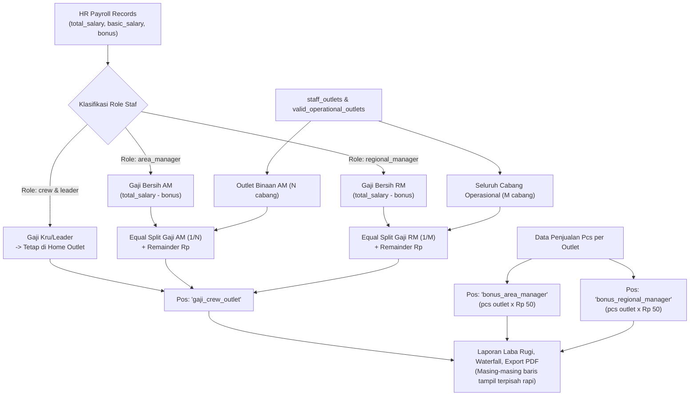

# Spesifikasi Desain: Distribusi Beban Gaji Area Manager (AM) & Regional Manager (RM)

## 1. Latar Belakang & Masalah
Saat ini, di modul Laba Rugi (`opexProrata.ts`), seluruh beban gaji staf ditarik langsung dari slip payroll HR (`payroll_records`) berdasarkan `outlet_staff.outlet_id` (home outlet).
Untuk posisi manajemen lapangan:
* **Area Manager (AM)** membawahi beberapa cabang operasional (4–6 outlet).
* **Regional Manager (RM)** membawahi seluruh cabang operasional aktif perusahaan.
* **Masalah:** Home outlet tempat AM/RM terdaftar (misalnya *Suka Shawarma Depok Sukmajaya* atau *Suka Shawarma Empang*) saat ini menanggung 100% beban gaji pokok dan tunjangan manajer tersebut sendirian. Sementara cabang binaan lainnya menanggung Rp 0 beban gaji manajer.
* **Tujuan:** Mendistribusikan beban gaji bersih AM dan RM secara merata (*equal split*) ke seluruh cabang operasional binaannya, sementara komponen bonus AM dan RM tetap terpisah berdasarkan pcs cabang masing-masing ($\text{pcs} \times \text{Rp } 50$).

---

## 2. Aturan Bisnis & Keputusan Desain (Tervalidasi)

1. **Pemisahan Komponen Gaji vs Bonus (Model A):**
   * **Gaji Pokok & Tunjangan (Beban Gaji Manajer):**
     $$\text{Beban Gaji Manajer} = \text{total\_salary} - \text{bonus}$$
     Didistribusikan secara **dibagi rata (equal split)** ke outlet binaan operasional yang aktif.
   * **Bonus Manajer (Beban Bonus AM & RM):**
     Tetap dihitung berdasarkan **kontribusi penjualan pcs masing-masing cabang**:
     $$\text{Bonus AM per Outlet} = \text{pcs outlet} \times \text{Rp } 50$$
     $$\text{Bonus RM per Outlet} = \text{pcs outlet} \times \text{Rp } 50$$
     Outlet yang lebih ramai menanggung bonus AM/RM lebih besar sesuai proporsi penjualannya.

2. **Penyajian di Laba Rugi, Waterfall Card, dan Export PDF (Tetap Terpisah):**
   * **Pos Gaji (`gaji_crew_outlet`)**:
     Menampung total: $\text{Gaji Kru/Leader Toko} + \text{Alokasi Gaji AM} + \text{Alokasi Gaji RM}$.
   * **Pos Bonus AM (`bonus_area_manager`)**:
     Tetap berdiri sendiri sebagai baris terpisah di Waterfall dan PDF.
   * **Pos Bonus RM (`bonus_regional_manager`)**:
     Tetap berdiri sendiri sebagai baris terpisah di Waterfall dan PDF.
   * **Hasil:** Pembaca laporan melihat rincian terpisah secara transparan, tidak digabung jadi satu angka gelondongan, dan tidak ada duplikasi (*double counting*).

3. **Cakupan Outlet (Scope):**
   * **Hanya Cabang Operasional Jualan Aktif**:
     * `type IN ('internal', 'mitra')`
     * `is_active = true` dan `status = 'active'`
     * Dikecualikan: Kantor Pusat / HQ (`type = 'office'`), Gudang (`type = 'gudang'`), marketplace, dan outlet demo/test.
   * **Area Manager (AM)**: Dibagi rata ke cabang-cabang operasional yang dibina AM tersebut (dari relasi `staff_outlets`).
   * **Regional Manager (RM)**: Dibagi rata ke **seluruh** cabang operasional aktif.

4. **Pelepasan Beban dari Home Outlet:**
   * Gaji AM/RM tidak lagi menempel 100% di home outlet.
   * Home outlet hanya menanggung 1 porsi equal split gaji AM/RM (jika home outlet tersebut merupakan cabang operasional aktif), ditambah bonus sesuai pcs penjualan home outlet itu sendiri.

5. **Penanganan Sisa Pembulatan (Exact Remainder Distribution):**
   * Jika nilai gaji dibagi jumlah outlet menghasilkan angka pecahan desimal:
     * Alokasi dasar: $\text{floor}(\text{Beban} / N)$.
     * Sisa pembulatan: $\text{Beban} - (\text{Alokasi Dasar} \times N)$.
     * Sisa Rp disebar secara berurutan ke outlet binaan (+Rp 1 per outlet) hingga habis.
   * **Jaminan Invariant:** $\sum \text{Alokasi Outlet} \equiv \text{Beban Gaji Asli}$ (selisih Rp 0).

---

## 3. Arsitektur & Alur Data



---

## 4. Komponen yang Dimodifikasi

1. **`apps/admin-dashboard/src/lib/opexProrata.ts`**:
   * Perluas interface `CalculateProrataInput`:
     ```ts
     managerMappings?: {
       staff_id: string
       role: 'area_manager' | 'regional_manager'
       outlet_ids: string[]
     }[]
     operationalOutletIds?: string[]
     ```
   * Dalam perhitungan gaji (Mode 1 & Mode 2):
     * Pisahkan baris payroll menjadi `crewRows` vs `managerRows`.
     * Home outlet AM/RM dikeluarkan dari beban 100% gaji manajer.
     * Alokasikan beban gaji bersih manajer secara equal-split ke cabang-cabang binaan operasional.
     * Tambahkan porsi alokasi ke akumulasi `gaji_crew_outlet` masing-masing cabang.
     * Pastikan perhitungan `bonus_area_manager` dan `bonus_regional_manager` tetap berjalan berdasarkan pcs outlet ($\text{pcs} \times \text{Rp } 50$).
2. **`apps/admin-dashboard/src/hooks/useProratedOpex.ts`**:
   * Ambil relasi `staff_outlets` untuk role `area_manager` dan `regional_manager`.
   * Ambil daftar outlet operasional aktif.
   * Teruskan parameter ke `calculateProratedExpenses`.
3. **`apps/admin-dashboard/src/app/actions/prorataAuxiliary.ts` & `mitraPnl.ts`**:
   * Tambahkan query serupa agar kalkulasi server-side dan client-side 100% identik.
4. **`apps/admin-dashboard/src/lib/periodCache.ts`**:
   * Bump cache version ke `v10`.

---

## 5. Rencana Pengujian (Test & Verification)

1. **Unit Testing (`opexProrata.test.ts`)**:
   * Test case distribusi gaji AM: Gaji Rp 3.500.000 membawahi 5 outlet binaan terdistribusi Rp 700.000 ke setiap binaan.
   * Test case distribusi gaji RM: Gaji Rp 5.000.000 terdistribusi equal split ke seluruh cabang operasional.
   * Test case bonus terpisah: Memverifikasi pos `bonus_area_manager` dan `bonus_regional_manager` tetap bernilai $\text{pcs} \times \text{Rp } 50$ per outlet.
   * Test case home outlet relief: Memverifikasi home outlet tidak lagi terbebani 100% gaji manajer.
   * Test case presisi rupiah: $\sum \text{Alokasi Outlet} \equiv \text{Beban Asli}$ (selisih Rp 0).
2. **Regression Testing**:
   * Jalankan seluruh suite tes vitest: `opexProrata.test.ts`, `profitWaterfall.test.ts`, `mitraPnl.test.ts`, `profitExportService.test.ts`.
3. **Verifikasi Data Riil September 2026**:
   * Pastikan total beban pengeluaran payroll perusahaan tidak berubah (zero rupiah diff).
