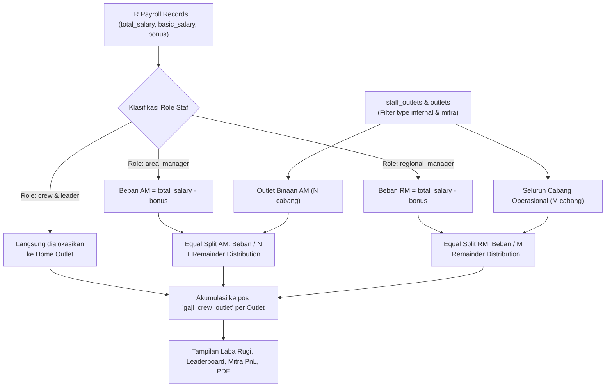

# Spesifikasi Desain: Distribusi Beban Gaji Area Manager (AM) & Regional Manager (RM)

## 1. Latar Belakang & Masalah
Saat ini, di modul Laba Rugi (`opexProrata.ts`), seluruh beban gaji staf ditarik langsung dari slip payroll HR (`payroll_records`) berdasarkan `outlet_staff.outlet_id` (home outlet).
Untuk posisi manajemen lapangan:
* **Area Manager (AM)** membawahi beberapa cabang (misal 4–6 outlet).
* **Regional Manager (RM)** membawahi seluruh cabang operasional aktif perusahaan.
* **Masalah:** Home outlet tempat AM/RM terdaftar (misalnya *Suka Shawarma Depok Sukmajaya* atau *Suka Shawarma Empang*) menanggung 100% beban gaji pokok dan tunjangan manajer tersebut sendirian di pos `gaji_crew_outlet`. Sementara cabang binaan lainnya menanggung Rp 0 beban gaji manajer.
* **Tujuan:** Mendistribusikan beban gaji bersih AM dan RM secara merata (*equal split*) ke seluruh cabang operasional binaannya, dengan jaminan **nol selisih (zero discrepancy)** pada total pengeluaran payroll perusahaan.

---

## 2. Aturan Bisnis & Keputusan Desain (Hasil Grilling)

1. **Komponen yang Didistribusikan:**
   * Hanya **Gaji Pokok & Tunjangan** (di luar bonus):
     $$\text{Beban Bersih Manajer} = \text{total\_salary} - \text{bonus}$$
   * Komponen bonus AM dan RM tetap berada di pos tersendiri (`bonus_area_manager` dan `bonus_regional_manager`) yang dihitung proporsional per outlet ($\text{pcs} \times \text{Rp } 50$). Hal ini mencegah terjadinya *double counting*.

2. **Metode Alokasi (Equal Split):**
   * Total beban bersih manajer dibagi sama rata ke jumlah cabang operasional binaannya.
   * Contoh: Gaji bersih AM = Rp 4.500.000, membawahi 5 cabang operasional $\rightarrow$ setiap cabang menanggung $\text{Rp } 4.500.000 / 5 = \text{Rp } 900.000$.

3. **Cakupan Outlet (Scope):**
   * **Hanya Cabang Operasional Jualan Aktif**:
     * `type IN ('internal', 'mitra')`
     * `is_active = true` dan `status = 'active'`
     * Dikecualikan: Kantor Pusat / HQ (`type = 'office'`), Gudang (`type = 'gudang'`), marketplace, dan outlet demo/test.
   * **Area Manager (AM)**: Dibagi rata ke cabang-cabang operasional yang dibina AM tersebut (diambil dari relasi `staff_outlets`).
   * **Regional Manager (RM)**: Dibagi rata ke **seluruh** cabang operasional aktif.

4. **Pos Pengeluaran di Laba Rugi:**
   * Alokasi beban gaji AM & RM dilebur dan dijumlahkan ke pos **`gaji_crew_outlet`** di masing-masing cabang binaan.
   * Home outlet tidak lagi menanggung 100% gaji AM/RM mereka sendirian, melainkan hanya menanggung 1 porsi bagian (jika home outlet tersebut merupakan cabang operasional aktif).

5. **Penanganan Sisa Pembulatan (Exact Remainder Distribution):**
   * Jika nilai gaji dibagi jumlah outlet menghasilkan angka pecahan desimal:
     * Alokasi dasar: $\text{floor}(\text{Beban} / N)$.
     * Sisa pembulatan: $\text{Beban} - (\text{Alokasi Dasar} \times N)$.
     * Sisa Rp disebar secara berurutan ke outlet binaan (+Rp 1 per outlet) hingga habis.
   * **Jaminan Invariant:** $\sum \text{Alokasi Outlet} \equiv \text{Beban Bersih Asli}$ (selisih Rp 0).

---

## 3. Arsitektur & Alur Data



---

## 4. Komponen yang Dimodifikasi

1. **`apps/admin-dashboard/src/lib/opexProrata.ts`**:
   * Perluas interface `CalculateProrataInput`:
     ```ts
     managerMappings?: {
       staff_id: string
       role: 'area_manager' | 'regional_manager'
       outlet_ids: string[]
     }[]
     operationalOutletIds?: string[]
     ```
   * Dalam perhitungan gaji (Mode 1 & Mode 2):
     * Pisahkan baris payroll menjadi `crewRows` vs `managerRows`.
     * Distribusikan beban `managerRows` ke outlet penerima.
     * Gabungkan alokasi manajer ke dalam `gajiMonthly` masing-masing outlet.
2. **`apps/admin-dashboard/src/hooks/useProratedOpex.ts`**:
   * Ambil data relasi `staff_outlets` untuk staf aktif ber-role `area_manager` dan `regional_manager`.
   * Ambil daftar outlet operasional valid (`valid_operational_outlets` atau `type in ('internal', 'mitra')`).
   * Oper data ini ke `calculateProratedExpenses`.
3. **`apps/admin-dashboard/src/app/actions/prorataAuxiliary.ts` & `mitraPnl.ts`**:
   * Tambahkan query serupa agar server-side loader sinkron dengan hook client-side.
4. **`apps/admin-dashboard/src/lib/periodCache.ts`**:
   * Bump cache version ke `v10` agar kalkulasi baru langsung aktif di browser tanpa menunggu cache basi.

---

## 5. Rencana Pengujian (Test & Verification)

1. **Unit Testing (`opexProrata.test.ts`)**:
   * Test case distribusi AM: Memverifikasi AM dengan beban Rp 3.500.000 membawahi 5 outlet menghasilkan alokasi Rp 700.000 ke setiap outlet binaan, dan Rp 0 ke outlet di luar binaan.
   * Test case distribusi RM: Memverifikasi RM dengan beban Rp 5.000.000 didistribusikan rata ke seluruh outlet operasional aktif.
   * Test case pembulatan presisi: Memverifikasi total alokasi seluruh outlet sama persis dengan total slip manajer sampai ke rupiah terakhir (selisih = Rp 0).
   * Test case pelepasan home outlet: Memverifikasi home outlet AM/RM tidak lagi menanggung 100% gaji manajer.
2. **Regresi Laba Rugi Keseluruhan**:
   * Jalankan seluruh suite tes vitest: `opexProrata.test.ts`, `profitWaterfall.test.ts`, `mitraPnl.test.ts`, `profitExportService.test.ts`.
3. **Verifikasi Data Riil**:
   * Cek perbandingan angka sebelum vs sesudah untuk September 2026: Total beban payroll seluruh cabang perusahaan harus **tetap sama persis**.
